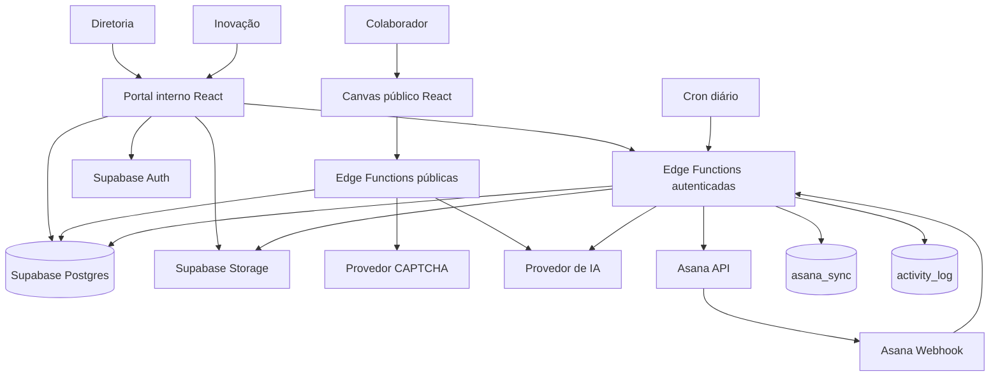
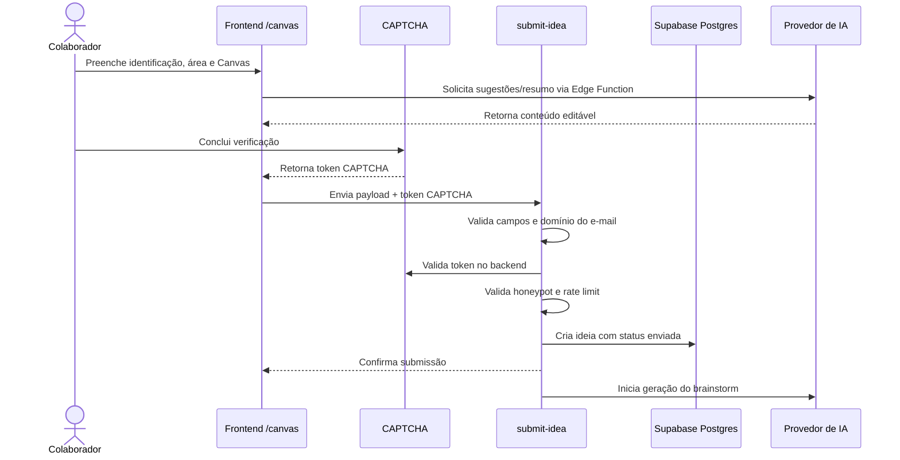
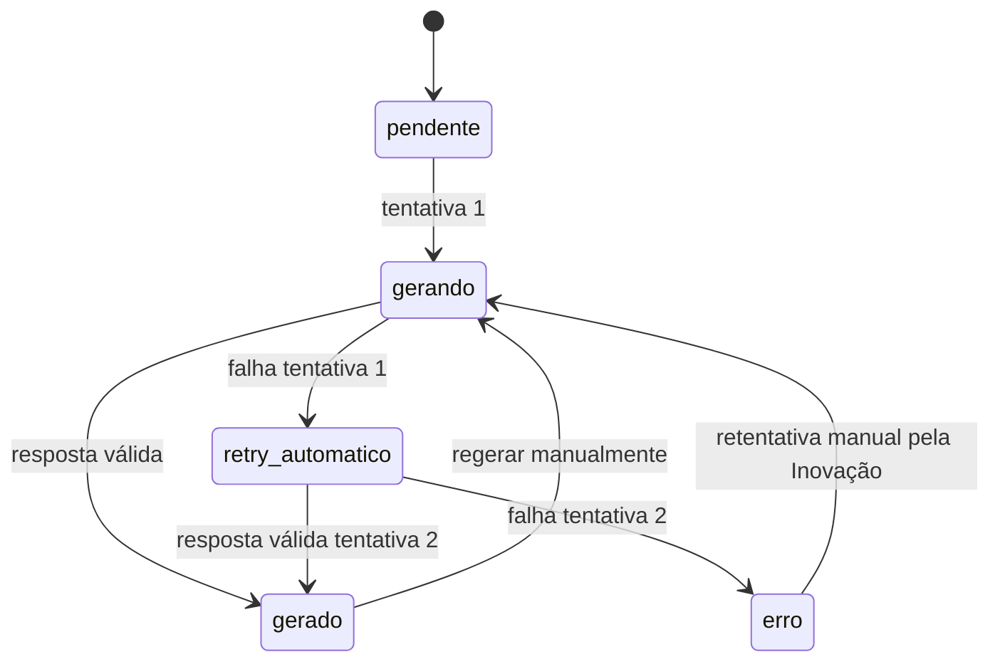
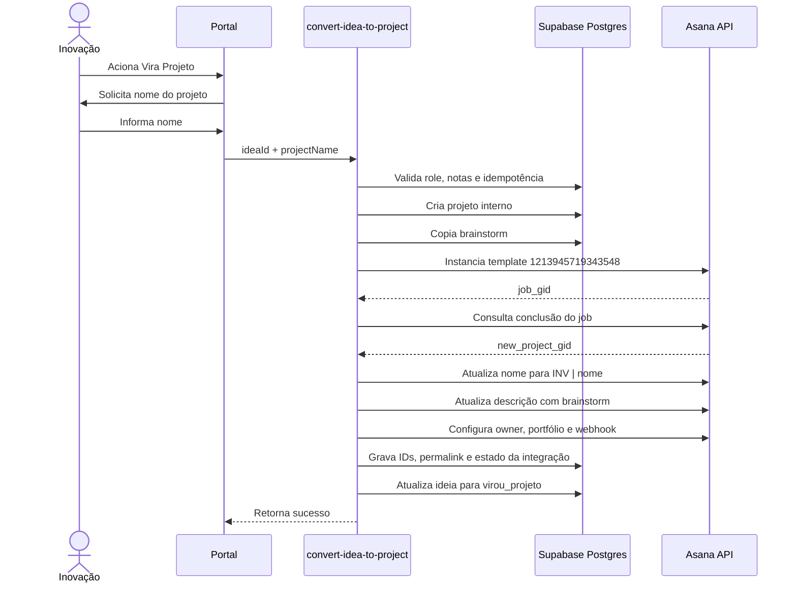
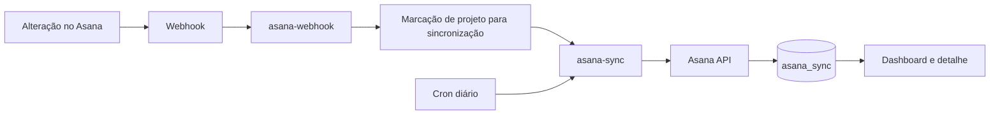
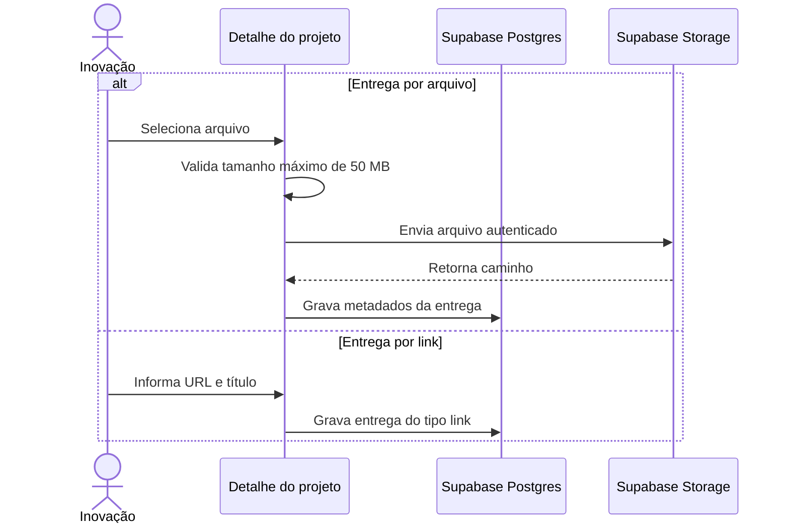

# Design Técnico — Portal de Gestão da Inovação Rennova

> Fonte técnica para implementação, revisão e manutenção do **Rennova Spark Hub**.  
> Este documento deriva da versão 0.6 da especificação funcional e consolida Canvas público protegido por CAPTCHA, Brainstorm Estratégico com IA, triagem, integração com Asana pelo template obrigatório, entregas no Supabase Storage e governança de projetos.

---

<a id="sumario"></a>
## Sumário

- [1. Identificação do projeto](#dt-1-identificacao-do-projeto)
- [2. Resumo técnico da solução](#dt-2-resumo-tecnico-da-solucao)
- [3. Arquitetura e fluxos técnicos](#dt-3-arquitetura-e-fluxos-tecnicos)
- [4. Stack tecnológica](#dt-4-stack-tecnologica)
- [5. Decisões técnicas](#dt-5-decisoes-tecnicas)
- [6. Modelo de dados](#dt-6-modelo-de-dados)
- [7. Contratos de API e Edge Functions](#dt-7-contratos-de-api-e-edge-functions)
- [8. Integrações externas](#dt-8-integracoes-externas)
- [9. Autenticação, autorização e RLS](#dt-9-autenticacao-autorizacao-e-rls)
- [10. Tratamento de erros, retentativas e idempotência](#dt-10-tratamento-de-erros-retentativas-e-idempotencia)
- [11. Logs e observabilidade](#dt-11-logs-e-observabilidade)
- [12. Segurança técnica](#dt-12-seguranca-tecnica)
- [13. Deploy e ambientes](#dt-13-deploy-e-ambientes)
- [14. Variáveis e configurações](#dt-14-variaveis-e-configuracoes)
- [15. Riscos técnicos](#dt-15-riscos-tecnicos)
- [16. Rastreabilidade funcional](#dt-16-rastreabilidade-funcional)
- [17. Aprovação técnica](#dt-17-aprovacao-tecnica)

---

<a id="dt-1-identificacao-do-projeto"></a>
## 1. Identificação do projeto

| Campo | Valor |
|---|---|
| Nome do projeto | Rennova Spark Hub — Portal de Gestão da Inovação |
| Responsável técnico | Phablo Tavares |
| Área/Time | Inovação / Desenvolvimento de Agentes e Soluções de IA |
| Documento funcional de referência | `especificacao-funcional-portal-inovacao.md`, versão 0.6 |
| Data | 2026-07-13 |
| Versão | 0.5 |
| Alteração desta versão | CAPTCHA obrigatório, domínios autorizados, sessão padrão Supabase, retentativa de brainstorm, triagem consolidada, template fixo Asana, brainstorm na descrição, entregas no Storage e novas regras de comentários. |

---

<a id="dt-2-resumo-tecnico-da-solucao"></a>
## 2. Resumo técnico da solução

O Rennova Spark Hub será uma aplicação web React/Vite, evoluída prioritariamente pelo Lovable, com Supabase como plataforma de backend.

A solução será dividida em:

- **Canvas público:** submissão de ideias sem login, protegida por CAPTCHA, honeypot, rate limit e validação de domínio de e-mail;
- **portal interno:** autenticação por Supabase Auth e autorização pelos perfis `diretoria` e `inovacao`;
- **governança:** ideias, triagem, projetos, métricas, comentários, entregas e auditoria armazenados no Supabase;
- **IA:** sugestões para o Canvas, resumo, Brainstorm Estratégico SCAMPER e insights;
- **Asana:** execução operacional de tarefas e sprints;
- **sincronização:** webhook como mecanismo principal e cron diário como reconciliação;
- **arquivos:** Supabase Storage para entregas de projetos, limitadas a 50 MB por arquivo.

O Supabase será a fonte de verdade dos dados de governança. O Asana será uma integração operacional e não substituirá os registros internos.

Chamadas a provedores de IA, CAPTCHA e Asana que dependam de credenciais ou validações sensíveis ocorrerão por Edge Functions. Nenhum token externo ou `service_role` poderá ser exposto no front-end.

---

<a id="dt-3-arquitetura-e-fluxos-tecnicos"></a>
## 3. Arquitetura e fluxos técnicos

### 3.1 Arquitetura geral



### 3.2 Componentes e responsabilidades

| Componente | Responsabilidade |
|---|---|
| Frontend público | Formulário do Canvas, sugestões de IA, resumo, CAPTCHA e confirmação de envio. |
| Frontend interno | Dashboard, ideias, matriz, triagem, projetos, entregas, comentários e administração. |
| Supabase Auth | Autenticação interna e gerenciamento padrão de sessão. |
| Supabase Postgres | Fonte de verdade de ideias, projetos, governança e auditoria. |
| Supabase RLS | Controle de leitura e escrita por perfil e vínculo do usuário. |
| Edge Functions públicas | Validação de submissão, domínio, CAPTCHA, anti-spam e chamadas de IA. |
| Edge Functions autenticadas | Triagem, conversão, IA interna, Asana, uploads controlados e exclusões. |
| Supabase Storage | Armazenamento dos arquivos de entrega dos projetos. |
| Provedor de IA | Sugestões, resumo, brainstorm SCAMPER e insights. |
| Asana | Operação de tarefas e sprints do projeto. |
| Webhook Asana | Atualização principal do cache operacional. |
| Cron diário | Reconciliação de dados do Asana. |

### 3.3 Fluxo técnico de submissão pública



Regras técnicas do fluxo:

- o front-end não insere diretamente na tabela `ideas`;
- o e-mail deve terminar exatamente em um dos domínios autorizados, sem diferenciar maiúsculas de minúsculas;
- o token CAPTCHA deve ser validado pelo backend;
- falha de CAPTCHA impede a criação da ideia;
- falha de IA após a criação não remove a ideia;
- dados não enviados permanecem apenas no estado local do navegador;
- `beforeunload` e interceptação de navegação devem alertar sobre perda dos dados.

### 3.4 Fluxo técnico do Brainstorm Estratégico



Processamento:

1. buscar os dados completos da ideia;
2. montar prompt com SCAMPER, contexto e contrato JSON;
3. executar a tentativa inicial;
4. validar schema e regras de negócio;
5. em caso de falha, executar uma única retentativa automática;
6. após duas falhas, gravar `brainstorm_status = erro`;
7. disponibilizar retentativa manual no detalhe da ideia somente para Inovação;
8. não versionar integralmente cada geração no MVP;
9. registrar tentativas e resultado em log técnico e funcional.

### 3.5 Fluxo de triagem

```text
/ideias?aba=triagem
  -> carregar ideias elegíveis
  -> exibir Canvas, resumo, brainstorm e classificação inicial
  -> Inovação informa impacto_final e esforco_final
  -> escolher Backlog, Arquivar/Rejeitar ou Vira Projeto
  -> arquivamento exige justificativa
  -> registrar responsável, data e participantes informados
  -> atualizar status e activity_log
```

A Diretoria pode acessar a aba e os detalhes, mas não pode alterar notas nem registrar decisões.

### 3.6 Fluxo de conversão em projeto e Asana



Regras técnicas:

- template obrigatório: `INV | Modelo Base`;
- identificador técnico: `1213945719343548`;
- nome final: `INV | {nome informado}`;
- remover prefixo duplicado caso o usuário já digite `INV |`;
- preservar seções, sprints, tarefas padrão e campos do template;
- inserir o brainstorm na descrição do projeto;
- não criar task específica para o brainstorm;
- impedir dupla conversão por constraint e chave de idempotência;
- registrar o `asana_project_gid` assim que ele existir, mesmo em falha parcial posterior;
- não marcar a conversão como totalmente concluída enquanto houver falha crítica não recuperada.

### 3.7 Sincronização Asana → Portal



Dados mínimos sincronizados:

- total de tarefas;
- tarefas abertas e concluídas;
- status das tarefas;
- responsável;
- data de início;
- data de conclusão ou vencimento, quando disponível;
- progresso consolidado;
- data e status da última sincronização.

O front-end não deve consultar a API do Asana durante a renderização.

### 3.8 Gestão de entregas



Regras:

- qualquer extensão é permitida;
- o portal não executa nem renderiza conteúdo potencialmente ativo;
- arquivos devem ser tratados como download ou visualização segura fornecida pelo navegador;
- limite de 50 MB deve ser validado no front-end e no backend/política de upload;
- os objetos devem ser gravados com nome interno não previsível;
- metadados ficam em `project_deliveries`;
- acesso deve respeitar autenticação e RLS;
- exclusão do registro deve excluir ou invalidar o objeto correspondente.

### 3.9 Comentários de governança

- Diretoria e Inovação podem criar comentários.
- Comentários publicados são imutáveis.
- Não haverá endpoint de edição.
- O autor pode excluir o próprio comentário.
- Inovação pode excluir qualquer comentário por governança.
- Criação e exclusão devem gerar log.
- Recomenda-se exclusão lógica para preservar auditoria, com `deleted_at` e `deleted_by`.

---

<a id="dt-4-stack-tecnologica"></a>
## 4. Stack tecnológica

| Camada | Tecnologia | Uso |
|---|---|---|
| Frontend | React, Vite, TypeScript | Aplicação pública e interna. |
| UI | Tailwind, shadcn/Radix, Recharts | Componentes, dashboard e matriz. |
| Queries | TanStack React Query | Cache e sincronização client-side. |
| Backend | Supabase Edge Functions | Regras sensíveis, integrações e validações. |
| Banco | Supabase Postgres | Fonte de verdade do portal. |
| Auth | Supabase Auth | Login e sessão padrão. |
| Autorização | Supabase RLS + Edge Functions | Controle por perfil. |
| Arquivos | Supabase Storage | Entregas de projetos. |
| IA | Provider configurado por secret | Sugestões, resumo, brainstorm e insights. |
| CAPTCHA | Provider configurado por secret | Validação humana do Canvas. |
| Operação | Asana REST API + Webhooks | Projetos, tarefas, sprints e sincronização. |
| Auditoria | `activity_log` + logs das Edge Functions | Rastreabilidade e troubleshooting. |
| Deploy frontend | Lovable | Publicação do app web. |
| Deploy backend | Supabase | Banco, Auth, Storage, Functions e secrets. |

---

<a id="dt-5-decisoes-tecnicas"></a>
## 5. Decisões técnicas

| Código | Decisão | Justificativa |
|---|---|---|
| DT001 | Lovable como principal fonte de evolução do front-end | Preserva o fluxo visual existente. |
| DT002 | Supabase como fonte de verdade | Centraliza governança, RLS, auditoria, arquivos e dados internos. |
| DT003 | Chamadas externas sensíveis apenas por Edge Functions | Protege credenciais e permite validação server-side. |
| DT004 | Sessão padrão do Supabase Auth | Evita comportamento customizado sem necessidade funcional. |
| DT005 | CAPTCHA validado no backend | Impede confiança no estado manipulável do front-end. |
| DT006 | Domínios permitidos em configuração server-side | Facilita validação consistente e auditável. |
| DT007 | Campo de área do Canvas como texto livre | Desacopla submissão pública do cadastro interno de departamentos. |
| DT008 | Brainstorm armazenado em JSONB | Mantém flexibilidade para as três soluções no MVP. |
| DT009 | Duas tentativas automáticas de brainstorm | Atende à regra funcional sem criar ciclo indefinido. |
| DT010 | Matriz e triagem como abas de `/ideias` | Simplifica navegação e reutiliza contexto. |
| DT011 | Asana como ferramenta operacional | O portal preserva governança e rastreabilidade. |
| DT012 | Template Asana fixo por ID | Evita criação de projetos vazios ou estrutura divergente. |
| DT013 | Brainstorm na descrição do projeto Asana | Evita task artificial e mantém contexto visível no projeto. |
| DT014 | Conversão idempotente | Impede projetos duplicados em retentativas. |
| DT015 | Webhook principal e cron diário de reconciliação | Combina atualização rápida e recuperação de divergências. |
| DT016 | Entregas em Supabase Storage | Mantém arquivos e permissões na mesma plataforma. |
| DT017 | Comentários imutáveis | Simplifica auditoria; correções ocorrem por exclusão e novo comentário. |
| DT018 | Exclusão lógica de comentários recomendada | Preserva rastreabilidade sem exibir conteúdo removido. |

---

<a id="dt-6-modelo-de-dados"></a>
## 6. Modelo de dados

### 6.1 Entidades principais

| Entidade | Responsabilidade |
|---|---|
| `profiles` | Perfil interno, role e status do usuário. |
| `departments` | Cadastro interno usado em projetos, filtros e administração. |
| `ideas` | Canvas, autor, resumo, brainstorm, notas e decisão. |
| `triage_sessions` | Sessões e períodos de triagem. |
| `idea_triage_decisions` | Decisão, justificativa e participantes. |
| `projects` | Governança dos projetos convertidos. |
| `project_phases` | Fases executivas do projeto. |
| `project_phase_tasks` | Checklist executivo. |
| `project_metrics` | Metas, resultados e insights. |
| `project_comments` | Comentários imutáveis de governança. |
| `project_deliveries` | Links e metadados de arquivos. |
| `asana_sync` | Cache operacional do Asana. |
| `asana_webhooks` | Controle de webhooks. |
| `integration_operations` | Estado de operações idempotentes e recuperação parcial. |
| `activity_log` | Auditoria funcional. |

### 6.2 Campos principais de `ideas`

| Campo | Tipo sugerido | Observação |
|---|---|---|
| `id` | uuid | Identificador. |
| `title` | text | Título da ideia. |
| `description` | text | Descrição original. |
| `author_name` | text | Nome do autor. |
| `author_email` | text | E-mail corporativo validado. |
| `area_text` | text | Área/departamento informado em texto livre. |
| `canvas_data` | jsonb | Respostas do Canvas. |
| `status` | enum/text | Estado controlado da ideia. |
| `ai_summary` | text | Resumo consolidado. |
| `summary_status` | enum/text | `pendente`, `gerando`, `gerado`, `erro`. |
| `strategic_brainstorm` | jsonb | Brainstorm completo. |
| `brainstorm_status` | enum/text | `pendente`, `gerando`, `gerado`, `erro`. |
| `brainstorm_attempt_count` | smallint | Tentativas da geração atual. |
| `brainstorm_last_error` | text | Erro sanitizado. |
| `brainstorm_generated_at` | timestamptz | Última geração válida. |
| `recommended_solution_id` | text | Solução recomendada. |
| `impact_ai` | smallint | Nota inicial da IA. |
| `effort_ai` | smallint | Nota inicial da IA. |
| `impact_final` | smallint | Nota final da triagem. |
| `effort_final` | smallint | Nota final da triagem. |
| `quadrant` | enum/text | Quadrante calculado. |
| `converted_project_id` | uuid | Projeto gerado, quando aplicável. |
| `created_at` | timestamptz | Criação. |
| `updated_at` | timestamptz | Atualização. |

### 6.3 Campos de decisão de triagem

| Campo | Tipo sugerido | Observação |
|---|---|---|
| `id` | uuid | Identificador. |
| `idea_id` | uuid | Ideia avaliada. |
| `triage_session_id` | uuid | Sessão associada. |
| `decision` | enum/text | `virou_projeto`, `backlog`, `arquivada`. |
| `reason` | text | Obrigatório para arquivar/rejeitar. |
| `participants` | text[] ou jsonb | Participantes informados. |
| `decided_by` | uuid | Usuário Inovação. |
| `decided_at` | timestamptz | Data da decisão. |

### 6.4 Campos principais de `projects`

| Campo | Tipo sugerido | Observação |
|---|---|---|
| `id` | uuid | Identificador. |
| `origin_idea_id` | uuid | Vínculo único com ideia. |
| `name` | text | Nome sem ou com prefixo normalizado. |
| `status` | enum/text | Status executivo. |
| `phase` | enum/text | Fase atual. |
| `objective` | text | Objetivo. |
| `problem` | text | Problema. |
| `description` | text | Descrição interna. |
| `strategic_brainstorm` | jsonb | Snapshot usado na conversão. |
| `recommended_solution_id` | text | Solução herdada. |
| `asana_project_gid` | text | ID Asana. |
| `asana_permalink` | text | Link para o Asana. |
| `asana_integration_status` | enum/text | `pending`, `creating`, `partial`, `synced`, `error`. |
| `created_at` | timestamptz | Criação. |
| `updated_at` | timestamptz | Atualização. |

### 6.5 Estrutura do Brainstorm Estratégico

```ts
interface StrategicBrainstorm {
  framework: "SCAMPER";
  generatedAt: string;
  recommendedSolutionId: string;
  recommendationReason: string;
  solutions: [BrainstormSolution, BrainstormSolution, BrainstormSolution];
}

interface BrainstormSolution {
  id: string;
  title: string;
  scamperApproach:
    | "substituir"
    | "combinar"
    | "adaptar"
    | "modificar"
    | "propor_outro_uso"
    | "eliminar"
    | "reorganizar";
  description: string;
  strategicRationale: string;
  demandResolution: string;
  impactScore: number;
  impactJustification: string;
  effortScore: number;
  effortJustification: string;
  viabilityAnalysis: string;
  risks: string[];
  mitigations: string[];
}
```

### 6.6 `project_deliveries`

| Campo | Tipo sugerido | Observação |
|---|---|---|
| `id` | uuid | Identificador. |
| `project_id` | uuid | Projeto associado. |
| `type` | enum/text | `file` ou `link`. |
| `title` | text | Nome exibido. |
| `url` | text | URL externa para tipo link. |
| `storage_bucket` | text | Bucket do Storage. |
| `storage_path` | text | Caminho do objeto. |
| `original_filename` | text | Nome original. |
| `mime_type` | text | MIME informado/detectado. |
| `size_bytes` | bigint | Deve ser <= 52.428.800. |
| `created_by` | uuid | Usuário Inovação. |
| `created_at` | timestamptz | Criação. |
| `deleted_at` | timestamptz | Exclusão lógica, se adotada. |

### 6.7 `project_comments`

| Campo | Tipo sugerido | Observação |
|---|---|---|
| `id` | uuid | Identificador. |
| `project_id` | uuid | Projeto. |
| `body` | text | Conteúdo imutável. |
| `author_user_id` | uuid | Diretoria ou Inovação. |
| `created_at` | timestamptz | Publicação. |
| `deleted_at` | timestamptz | Exclusão lógica. |
| `deleted_by` | uuid | Autor ou usuário Inovação. |

Não deve existir operação funcional de `UPDATE body` após a publicação.

### 6.8 `asana_sync`

| Campo | Tipo sugerido | Observação |
|---|---|---|
| `project_id` | uuid | Projeto interno. |
| `asana_project_gid` | text | Projeto no Asana. |
| `task_count` | int | Total. |
| `open_task_count` | int | Abertas. |
| `completed_task_count` | int | Concluídas. |
| `tasks_snapshot` | jsonb | Status, responsável e datas. |
| `progress_pct` | numeric | Progresso operacional. |
| `last_synced_at` | timestamptz | Última sincronização. |
| `sync_status` | enum/text | Estado da sincronização. |
| `last_error` | text | Erro sanitizado. |

### 6.9 Índices e constraints

- `unique(projects.origin_idea_id)` para impedir dupla conversão;
- `unique(projects.asana_project_gid)` quando não nulo;
- índices em `ideas.status`, `ideas.created_at`, `ideas.quadrant`;
- checks para notas entre 1 e 10;
- check para `project_deliveries.size_bytes <= 52428800`;
- índice em `project_deliveries.project_id`;
- índice em `project_comments.project_id, created_at`;
- índice em `asana_sync.asana_project_gid`;
- índice em `activity_log.entity_type, entity_id, created_at`;
- índice ou unique key em `integration_operations.idempotency_key`.

---

<a id="dt-7-contratos-de-api-e-edge-functions"></a>
## 7. Contratos de API e Edge Functions

### API001 — `POST /functions/v1/submit-idea`

Responsabilidades:

- validar campos obrigatórios;
- normalizar e validar domínio do e-mail;
- validar CAPTCHA no provider;
- validar honeypot e rate limit;
- criar a ideia;
- iniciar resumo e brainstorm;
- retornar estado controlado.

Entrada resumida:

```json
{
  "authorName": "string",
  "authorEmail": "string",
  "areaText": "string",
  "title": "string",
  "canvas": {},
  "approvedSummary": "string|null",
  "captchaToken": "string",
  "honeypot": ""
}
```

### API002 — `POST /functions/v1/ai-assist-block`

Recebe o bloco atual, os campos já preenchidos e o objetivo geral. Retorna sugestão textual editável.

### API003 — `POST /functions/v1/ai-summarize-idea`

Gera resumo e classificação. Não deve expor notas de impacto/esforço ao autor.

### API004 — `POST /functions/v1/ai-generate-strategic-brainstorm`

Entrada mínima:

```json
{
  "ideaId": "uuid",
  "manualRetry": false
}
```

Comportamento:

- em execução automática, realizar no máximo duas tentativas;
- em execução manual, iniciar uma nova geração controlada;
- validar exatamente três soluções;
- gravar somente resposta válida;
- atualizar status e contadores.

### API005 — `POST /functions/v1/ideas/{id}/retry-brainstorm`

- requer usuário autenticado com role `inovacao`;
- permitido quando `brainstorm_status = erro`;
- pode também permitir regeração explícita conforme interface;
- registra autor da retentativa.

### API006 — `POST /functions/v1/ideas/{id}/triage`

Entrada:

```json
{
  "impactFinal": 8,
  "effortFinal": 4,
  "decision": "backlog|arquivada|virou_projeto",
  "reason": "string|null",
  "participants": ["string"]
}
```

Validações:

- role `inovacao`;
- notas de 1 a 10;
- justificativa obrigatória para arquivar/rejeitar;
- decisão “virou projeto” deve encaminhar para a API de conversão com nome do projeto.

### API007 — `POST /functions/v1/convert-idea-to-project`

Entrada:

```json
{
  "ideaId": "uuid",
  "projectName": "Portal de Documentos",
  "confirmWithoutBrainstorm": false
}
```

Responsabilidades:

1. validar role;
2. validar notas finais e nome;
3. normalizar para `INV | Portal de Documentos`;
4. gerar chave de idempotência;
5. criar projeto interno;
6. copiar o brainstorm;
7. instanciar o template `1213945719343548`;
8. aguardar o job Asana;
9. atualizar nome, descrição, owner e portfólio;
10. criar webhook;
11. gravar IDs e estados;
12. atualizar a ideia somente após estado seguro;
13. não criar task de brainstorm.

### API008 — `POST /functions/v1/asana-webhook`

- realizar handshake exigido pelo Asana;
- validar segredo/cabeçalhos aplicáveis;
- registrar eventos recebidos;
- acionar sincronização idempotente;
- responder rapidamente e evitar processamento pesado síncrono.

### API009 — `POST /functions/v1/asana-sync`

- sincronizar um projeto ou lote;
- atualizar `asana_sync`;
- usar retry/backoff para erros transitórios;
- respeitar rate limits;
- ser executada por webhook e pelo cron diário.

### API010 — `POST /functions/v1/projects/{id}/deliveries`

Para link:

```json
{
  "type": "link",
  "title": "Protótipo aprovado",
  "url": "https://..."
}
```

Para arquivo, o upload pode ocorrer diretamente no Storage com sessão autenticada e policy restrita, seguido do registro dos metadados. Alternativamente, uma Edge Function pode emitir URL de upload assinada.

Validações:

- role `inovacao`;
- tamanho máximo de 50 MB;
- projeto existente;
- caminho controlado;
- qualquer extensão aceita, sem execução pelo portal.

### API011 — `DELETE /functions/v1/projects/{projectId}/deliveries/{deliveryId}`

- somente Inovação;
- remover metadados e objeto quando aplicável;
- registrar auditoria.

### API012 — `POST /functions/v1/projects/{id}/comments`

- permitido para Diretoria e Inovação;
- comentário não vazio;
- gravação com autor e data.

### API013 — `DELETE /functions/v1/projects/{projectId}/comments/{commentId}`

- autor pode excluir o próprio comentário;
- Inovação pode excluir qualquer comentário;
- não existe endpoint de edição;
- registrar exclusão no `activity_log`.

### API014 — `POST /functions/v1/ai-generate-insight`

Gera insight executivo usando métrica, meta e resultado armazenados no Supabase.

---

<a id="dt-8-integracoes-externas"></a>
## 8. Integrações externas

### 8.1 Provedor de IA

Uso:

- sugestão por bloco;
- resumo da ideia;
- Brainstorm Estratégico SCAMPER;
- insight de métricas.

Regras:

- credenciais em secrets;
- timeout configurado;
- JSON estruturado para respostas persistidas;
- validação de schema;
- duas tentativas automáticas apenas para o brainstorm;
- logs sem prompt completo quando houver dados sensíveis.

### 8.2 Provedor CAPTCHA

Regras:

- widget ou desafio no front-end;
- token enviado à Edge Function;
- validação server-to-server;
- token de uso único ou validade curta conforme provider;
- ação, hostname e score validados quando suportados;
- indisponibilidade bloqueia a submissão.

### 8.3 Asana

Configuração fixa:

| Item | Valor |
|---|---|
| Template | `INV | Modelo Base` |
| Template GID | `1213945719343548` |
| Referência | `https://app.asana.com/0/project-templates/1213945719343548/list` |
| Nome do projeto | `INV | {nome informado}` |
| Brainstorm | Descrição do projeto |
| Task exclusiva de brainstorm | Não criar |

Conteúdo mínimo da descrição:

```md
# Brainstorm Estratégico

> Conteúdo gerado por IA para apoio à análise e planejamento. A solução final pode ser ajustada durante o projeto.

## Ideia de origem
- Título: [...]
- Área informada: [...]
- Data: [...]

## Solução recomendada
- Nome: [...]
- Justificativa: [...]
- Impacto: [1-10]
- Esforço: [1-10]

## Soluções avaliadas
### Solução 1
...

### Solução 2
...

### Solução 3
...

## Riscos e mitigações
...
```

### 8.4 Supabase Storage

Bucket recomendado: `project-deliveries`.

Estrutura de caminho:

```text
projects/{project_id}/{delivery_id}/{safe_filename}
```

Políticas:

- leitura para usuários internos autenticados autorizados;
- escrita e exclusão somente para Inovação;
- limite de 50 MB por objeto;
- nomes internos não previsíveis;
- metadados vinculados ao banco;
- URLs assinadas quando o bucket for privado.

---

<a id="dt-9-autenticacao-autorizacao-e-rls"></a>
## 9. Autenticação, autorização e RLS

### 9.1 Sessão

- usar persistência e renovação padrão do Supabase Auth;
- não implementar timeout customizado;
- ao falhar a renovação, limpar estado e redirecionar para `/login`;
- `profiles.ativo = false` bloqueia acesso mesmo com conta válida no Auth.

### 9.2 Matriz de acesso

| Recurso | Diretoria | Inovação | Público |
|---|---:|---:|---:|
| Canvas | - | - | Enviar via Edge Function |
| Dashboard | Ler | Ler | Não |
| Ideias/backlog | Ler | Ler/gerir | Não |
| Matriz | Ler | Ler/editar notas | Não |
| Triagem | Ler | Decidir | Não |
| Projetos | Ler | Gerir | Não |
| Entregas | Ler/baixar | Criar/excluir/ler | Não |
| Comentários | Criar, ler e excluir os próprios | Criar, ler e excluir qualquer | Não |
| Admin | Não | Gerir | Não |
| Retentativa de brainstorm | Não | Executar | Não |

### 9.3 RLS mínima

- `profiles`: usuário lê o próprio perfil; administração somente Inovação;
- `ideas`: leitura interna; alterações sensíveis somente Inovação;
- `projects`: leitura interna; escrita somente Inovação;
- `project_comments`: leitura interna; insert para Diretoria/Inovação; delete conforme autor ou role;
- `project_deliveries`: leitura interna; insert/delete somente Inovação;
- `activity_log`: insert por backend; leitura restrita à Inovação;
- Storage: policies equivalentes às permissões de entregas.

---

<a id="dt-10-tratamento-de-erros-retentativas-e-idempotencia"></a>
## 10. Tratamento de erros, retentativas e idempotência

| Situação | Comportamento esperado |
|---|---|
| E-mail fora da allowlist | Retornar erro funcional; não validar CAPTCHA nem criar ideia. |
| CAPTCHA inválido ou expirado | Bloquear submissão; não criar ideia. |
| CAPTCHA indisponível | Informar indisponibilidade; não criar ideia. |
| Falha ao salvar ideia | Retornar erro; não iniciar processos dependentes. |
| Falha de resumo IA | Salvar ideia com resumo pendente/erro. |
| Falha de brainstorm tentativa 1 | Executar uma retentativa automática. |
| Falha de brainstorm tentativa 2 | Marcar erro e permitir retentativa manual. |
| JSON inválido | Não persistir resposta inválida. |
| Nome do projeto vazio | Bloquear conversão. |
| Notas finais ausentes | Bloquear conversão. |
| Ideia já convertida | Retornar projeto existente ou conflito, sem duplicar. |
| Template Asana indisponível | Manter projeto interno em estado de erro/pendência; não confirmar conversão completa. |
| Job Asana com timeout | Persistir operação e permitir recuperação. |
| Projeto Asana criado, descrição falhou | Gravar GID e marcar integração parcial. |
| Falha no webhook | Registrar erro; cron diário reconcilia. |
| Arquivo > 50 MB | Bloquear antes da persistência. |
| Falha após upload e antes do metadata | Remover objeto órfão por rotina de compensação. |
| Exclusão de comentário sem permissão | Retornar 403. |

### 10.1 Idempotência da conversão

A conversão deve usar:

- unique constraint em `projects.origin_idea_id`;
- chave de idempotência por ideia/operação;
- tabela ou registro `integration_operations` com estado;
- transações para criação interna;
- persistência antecipada do GID Asana quando obtido;
- retomada da mesma operação em vez de criar novo projeto.

Estados sugeridos:

```text
pending -> internal_created -> asana_job_started -> asana_created
        -> description_updated -> configured -> completed
        -> partial_error | error
```

---

<a id="dt-11-logs-e-observabilidade"></a>
## 11. Logs e observabilidade

Eventos funcionais:

- submissão e falha de ideia;
- bloqueio por domínio, CAPTCHA ou rate limit;
- geração de resumo;
- cada ciclo de geração de brainstorm;
- retentativa manual;
- alteração de notas finais;
- decisão de triagem;
- arquivamento/rejeição;
- conversão em projeto;
- job de template Asana;
- atualização da descrição Asana;
- sincronização e falha do Asana;
- criação e exclusão de entrega;
- criação e exclusão de comentário;
- alteração de fase, métrica e administração.

Campos mínimos:

| Campo | Observação |
|---|---|
| `actor_user_id` | Usuário ou sistema. |
| `action` | Ação controlada. |
| `entity_type` | `idea`, `project`, `comment`, `delivery`, `asana`, `ai`, `admin`. |
| `entity_id` | Entidade associada. |
| `status` | `success`, `warning`, `error`. |
| `correlation_id` | Correlação entre Edge Functions. |
| `metadata` | JSON sanitizado. |
| `created_at` | Data/hora. |

Não registrar tokens, secrets, conteúdo binário, senha, `service_role` ou respostas completas desnecessárias da IA.

---

<a id="dt-12-seguranca-tecnica"></a>
## 12. Segurança técnica

- validar CAPTCHA e domínio no backend;
- restringir o insert público por RLS;
- usar rate limit por IP e outros sinais disponíveis;
- usar honeypot no Canvas;
- proteger secrets em ambiente Supabase;
- validar autenticação e role em Edge Functions;
- sanitizar conteúdo enviado ao Asana;
- validar URLs de entregas e impedir esquemas perigosos, aceitando preferencialmente `https`;
- não executar arquivos enviados;
- usar bucket privado e URLs assinadas quando aplicável;
- limitar upload a 50 MB;
- normalizar nomes de arquivo e impedir path traversal;
- tratar respostas de IA como não confiáveis;
- validar payloads com schema;
- proteger webhooks contra reprocessamento e chamadas inválidas;
- evitar exposição de mensagens técnicas ao usuário.

---

<a id="dt-13-deploy-e-ambientes"></a>
## 13. Deploy e ambientes

| Camada | Ambiente | Observação |
|---|---|---|
| Frontend | Lovable | Aplicação web pública e interna. |
| Supabase | Projeto do ambiente | Auth, banco, RLS, Storage e Edge Functions. |
| IA | Conta/projeto corporativo | Credencial por secret. |
| CAPTCHA | Conta/site configurado | Chaves pública e privada por ambiente. |
| Asana | Workspace corporativo | Token com acesso ao template e portfólio. |

Ordem de implantação:

1. aplicar migrations e constraints;
2. criar bucket e policies do Storage;
3. publicar Edge Functions;
4. configurar secrets e allowlist de domínios;
5. configurar CAPTCHA;
6. configurar acesso ao template Asana;
7. configurar webhook e cron;
8. publicar o front-end;
9. executar o plano de validação;
10. registrar evidências e aprovação.

---

<a id="dt-14-variaveis-e-configuracoes"></a>
## 14. Variáveis e configurações

| Variável | Uso |
|---|---|
| `SUPABASE_URL` | URL do projeto Supabase. |
| `SUPABASE_ANON_KEY` | Chave pública permitida no front-end. |
| `SUPABASE_SERVICE_ROLE_KEY` | Apenas backend seguro. |
| `AI_PROVIDER` | Provider de IA. |
| `AI_API_KEY` | Chave da IA. |
| `AI_MODEL_ASSIST` | Sugestões do Canvas. |
| `AI_MODEL_SUMMARY` | Resumo. |
| `AI_MODEL_BRAINSTORM` | Brainstorm. |
| `AI_MODEL_INSIGHT` | Insights. |
| `CAPTCHA_PROVIDER` | Provider selecionado. |
| `CAPTCHA_SITE_KEY` | Chave pública do widget. |
| `CAPTCHA_SECRET_KEY` | Chave privada do backend. |
| `ALLOWED_IDEA_EMAIL_DOMAINS` | `nutriex.com.br,nutriex.com,innovapharma.com,rennova.com`. |
| `ASANA_ACCESS_TOKEN` | Token Asana. |
| `ASANA_WORKSPACE_GID` | Workspace. |
| `ASANA_TEAM_GID` | Time, se aplicável. |
| `ASANA_PROJECT_TEMPLATE_GID` | Valor fixo `1213945719343548`. |
| `ASANA_PORTFOLIO_GID` | Portfólio. |
| `ASANA_DEFAULT_OWNER_GID` | Owner padrão, se aplicável. |
| `ASANA_WEBHOOK_SECRET` | Validação de webhook. |
| `PROJECT_DELIVERIES_BUCKET` | `project-deliveries`. |
| `PROJECT_DELIVERY_MAX_BYTES` | `52428800`. |
| `BRAINSTORM_AUTO_ATTEMPTS` | `2`. |

---

<a id="dt-15-riscos-tecnicos"></a>
## 15. Riscos técnicos

| Risco | Impacto | Mitigação |
|---|---|---|
| Provider CAPTCHA indisponível | Submissão bloqueada | Mensagem controlada e monitoramento. |
| Validação de domínio inconsistente | Acesso indevido ou bloqueio incorreto | Função server-side única e testes automatizados. |
| IA retorna JSON inválido | Brainstorm não gerado | Schema, duas tentativas e retentativa manual. |
| IA gera conteúdo genérico | Baixa utilidade | Prompt estruturado com SCAMPER e contexto completo. |
| Conversão duplicada | Projetos duplicados | Constraint, idempotência e estado de operação. |
| Template Asana sem acesso | Conversão incompleta | Validação prévia e erro recuperável. |
| Falha após criação do Asana | Estado parcial | Persistir GID e retomar operação. |
| Descrição do Asana muito extensa | Falha ou truncamento | Formatação controlada e validação de limites da API. |
| Divergência Asana/Portal | Dados operacionais incorretos | Webhook + cron diário. |
| Upload de arquivo malicioso | Risco ao usuário | Não executar, bucket privado e download controlado. |
| Objeto órfão no Storage | Consumo desnecessário | Compensação e rotina de limpeza. |
| Exclusão indevida de comentário | Perda de governança | RLS, validação server-side e auditoria. |
| Tokens expostos | Incidente de segurança | Secrets e revisão de build/logs. |

---

<a id="dt-16-rastreabilidade-funcional"></a>
## 16. Rastreabilidade funcional

| Área técnica | Requisitos funcionais relacionados |
|---|---|
| Auth e sessão | RF001, RF002 |
| Canvas, domínios e CAPTCHA | RF003, RF004, RF005 |
| Dashboard e matriz | RF006, RF007 |
| Triagem e histórico | RF008 |
| Conversão e template Asana | RF009, RF020, RF021 |
| Projeto e entregas | RF010, RF011, RF012 |
| Cache e sincronização Asana | RF013, RF016 |
| Comentários | RF014 |
| Administração | RF015 |
| Auditoria | RF017 |
| Brainstorm e retentativas | RF018, RF019 |

---

<a id="dt-17-aprovacao-tecnica"></a>
## 17. Aprovação técnica

| Papel | Nome | Status | Data |
|---|---|---|---|
| Responsável técnico | Phablo Tavares | Pendente | - |
| Responsável funcional | A definir | Pendente | - |
| Gerência solicitante | A definir | Pendente | - |