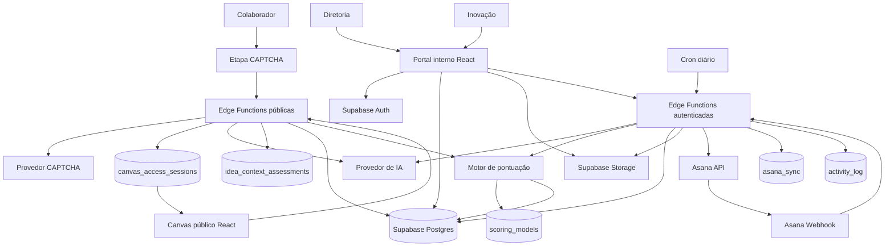
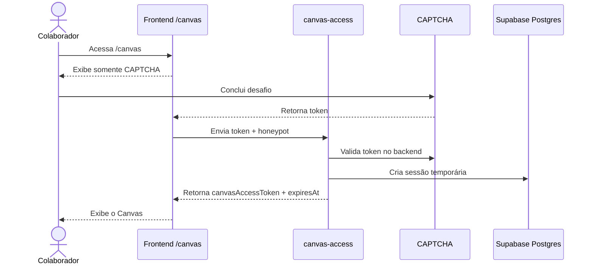
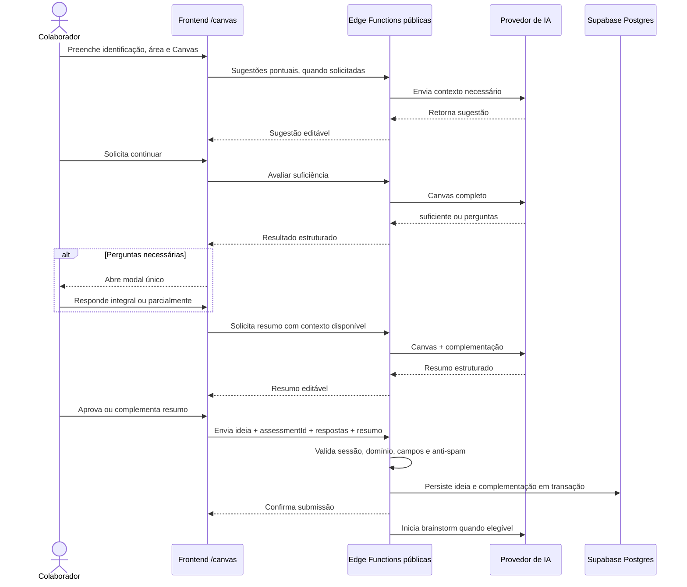
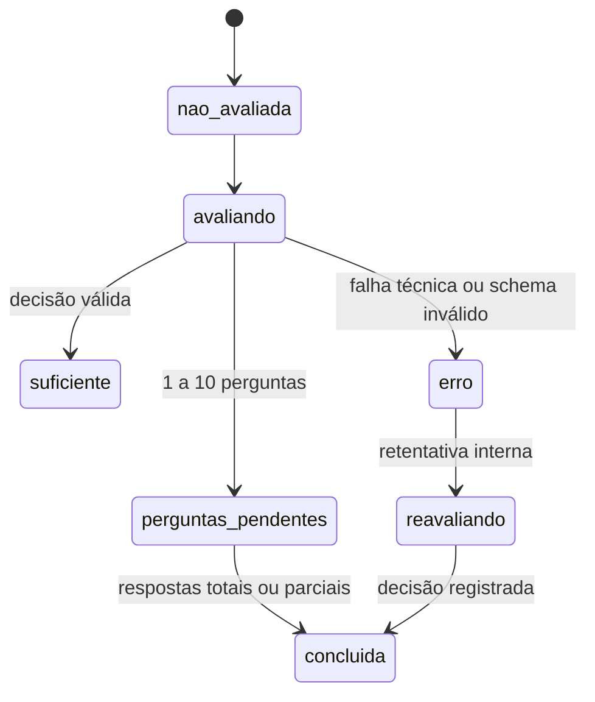
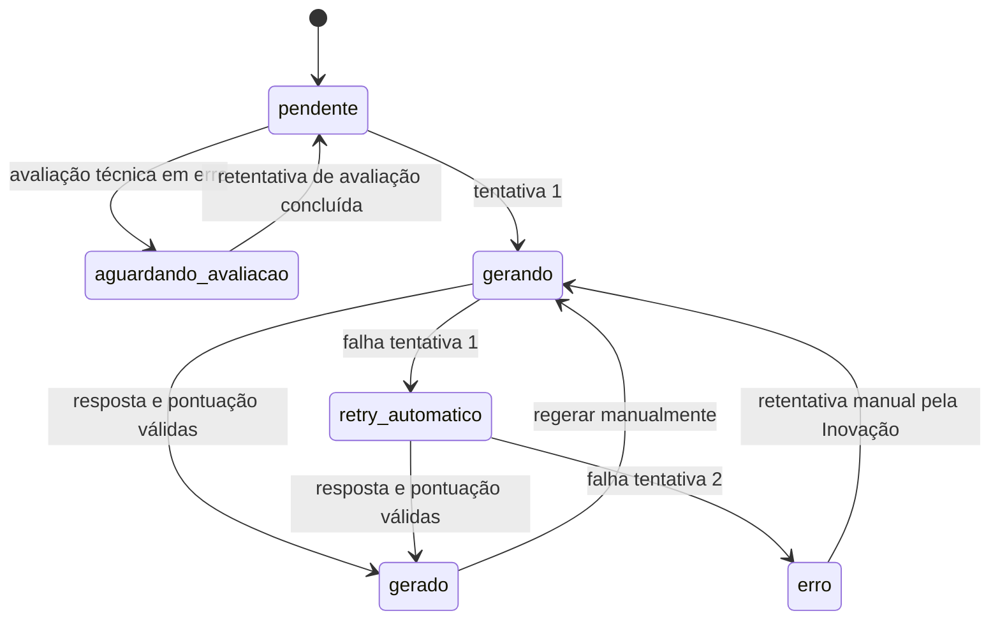
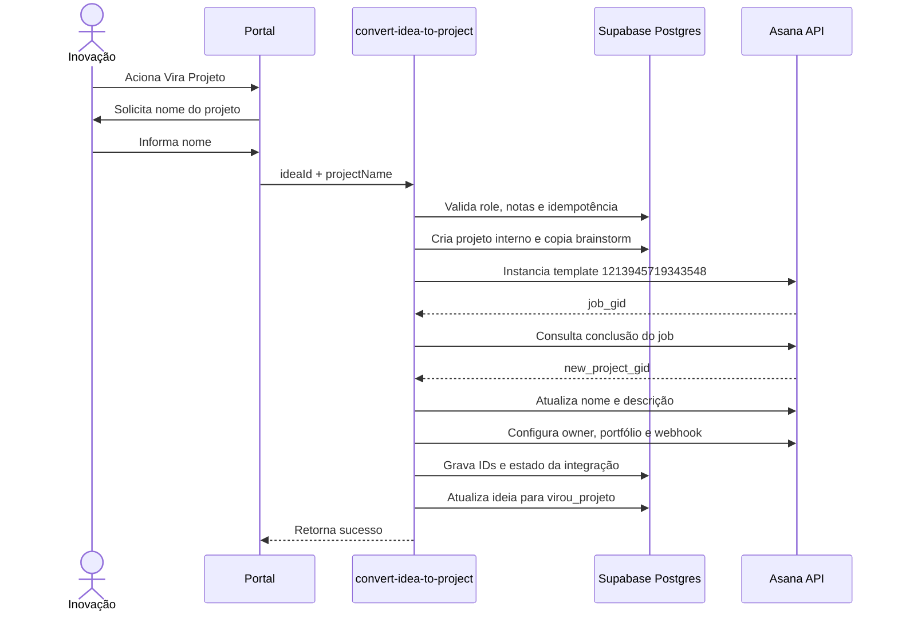
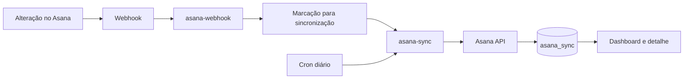

# Design Técnico — Portal de Gestão da Inovação Rennova

> Fonte técnica para implementação, revisão e manutenção do **Rennova Spark Hub**.  
> Este documento deriva da versão 0.8 da especificação funcional e consolida o acesso ao Canvas após CAPTCHA, a avaliação de suficiência e complementação estratégica por IA, o Brainstorm Estratégico, a pontuação ponderada de Impacto × Esforço, a triagem, a integração com o Asana, as entregas e a governança de projetos.

---

<a id="sumario"></a>
## Sumário

- [1. Identificação do projeto](#dt-1-identificacao-do-projeto)
- [2. Resumo técnico da solução](#dt-2-resumo-tecnico-da-solucao)
- [3. Arquitetura e fluxos técnicos](#dt-3-arquitetura-e-fluxos-tecnicos)
- [4. Stack tecnológica](#dt-4-stack-tecnologica)
- [5. Decisões técnicas](#dt-5-decisoes-tecnicas)
- [6. Modelo de dados](#dt-6-modelo-de-dados)
- [7. Contratos de API e Edge Functions](#dt-7-contratos-de-api-e-edge-functions)
- [8. Integrações externas](#dt-8-integracoes-externas)
- [9. Autenticação, autorização e RLS](#dt-9-autenticacao-autorizacao-e-rls)
- [10. Tratamento de erros, retentativas e idempotência](#dt-10-tratamento-de-erros-retentativas-e-idempotencia)
- [11. Logs e observabilidade](#dt-11-logs-e-observabilidade)
- [12. Segurança técnica](#dt-12-seguranca-tecnica)
- [13. Deploy e ambientes](#dt-13-deploy-e-ambientes)
- [14. Variáveis e configurações](#dt-14-variaveis-e-configuracoes)
- [15. Riscos técnicos](#dt-15-riscos-tecnicos)
- [16. Rastreabilidade funcional](#dt-16-rastreabilidade-funcional)
- [17. Aprovação técnica](#dt-17-aprovacao-tecnica)

---

<a id="dt-1-identificacao-do-projeto"></a>
## 1. Identificação do projeto

| Campo | Valor |
|---|---|
| Nome do projeto | Rennova Spark Hub — Portal de Gestão da Inovação |
| Responsável técnico | Phablo Tavares |
| Área/Time | Inovação / Desenvolvimento de Agentes e Soluções de IA |
| Documento funcional de referência | `especificacao-funcional-portal-inovacao.md`, versão 0.8 |
| Data | 2026-07-14 |
| Versão | 0.7 |
| Alteração desta versão | Adequação à especificação funcional 0.8: CAPTCHA antes do Canvas, avaliação única de suficiência, complementação estratégica persistida, recuperação controlada de falhas e novo catálogo de Impacto × Esforço com cinco critérios por métrica. |

---

<a id="dt-2-resumo-tecnico-da-solucao"></a>
## 2. Resumo técnico da solução

O Rennova Spark Hub será uma aplicação web React/Vite, evoluída prioritariamente pelo Lovable, com Supabase como plataforma de backend.

A solução será dividida em:

- **controle de acesso ao Canvas:** validação CAPTCHA no backend antes da exibição do formulário e emissão de sessão pública temporária;
- **Canvas público:** submissão de ideias sem login, protegida por sessão CAPTCHA, honeypot, rate limit e validação de domínio de e-mail;
- **complementação por IA:** avaliação de suficiência e, quando necessário, uma única rodada de até 10 perguntas estratégicas;
- **portal interno:** autenticação por Supabase Auth e autorização pelos perfis `diretoria` e `inovacao`;
- **governança:** ideias, complementações, triagem, projetos, métricas, comentários, entregas e auditoria armazenados no Supabase;
- **IA:** sugestões para o Canvas, avaliação de suficiência, resumo, Brainstorm Estratégico SCAMPER e insights;
- **pontuação:** cinco critérios de Impacto e cinco de Esforço, escalas discretas e cálculo reproduzível no backend;
- **Asana:** execução operacional de tarefas e sprints;
- **sincronização:** webhook como mecanismo principal e cron diário como reconciliação;
- **arquivos:** Supabase Storage para entregas de projetos, limitadas a 50 MB por arquivo.

O Supabase será a fonte de verdade dos dados de governança. O Asana será uma integração operacional e não substituirá os registros internos.

Chamadas a provedores de IA, CAPTCHA e Asana que dependam de credenciais ou validações sensíveis ocorrerão por Edge Functions. Nenhum token externo ou `service_role` poderá ser exposto no front-end.

---

<a id="dt-3-arquitetura-e-fluxos-tecnicos"></a>
## 3. Arquitetura e fluxos técnicos

### 3.1 Arquitetura geral



### 3.2 Componentes e responsabilidades

| Componente | Responsabilidade |
|---|---|
| Etapa CAPTCHA | Exibir a verificação antes do Canvas e solicitar a criação da sessão pública. |
| Frontend público | Canvas, sugestões por bloco, modal de complementação, resumo e confirmação de envio. |
| Frontend interno | Dashboard, ideias, complementações, matriz, triagem, projetos, entregas, comentários e administração. |
| Supabase Auth | Autenticação interna e gerenciamento padrão de sessão. |
| Supabase Postgres | Fonte de verdade de ideias, complementações, avaliações, projetos, governança e auditoria. |
| Supabase RLS | Controle de leitura e escrita por perfil e vínculo do usuário. |
| Edge Functions públicas | CAPTCHA, sessão do Canvas, domínio, anti-spam, avaliação de suficiência, resumo e submissão. |
| Edge Functions autenticadas | Triagem, recuperação de IA, conversão, Asana, uploads controlados e exclusões. |
| Motor de pontuação | Valida critérios e notas, resolve a âncora oficial, aplica pesos e calcula resultados. |
| Catálogo de pontuação | Mantém a versão ativa dos critérios, pesos, notas permitidas e escalas das seções 5.3 e 5.4. |
| Supabase Storage | Armazenamento dos arquivos de entrega dos projetos. |
| Provedor de IA | Sugestões, suficiência, perguntas, resumo, brainstorm e insights; não calcula o resultado autoritativo. |
| Asana | Operação de tarefas e sprints do projeto. |
| Webhook Asana | Atualização principal do cache operacional. |
| Cron diário | Reconciliação dos dados do Asana. |

### 3.3 Acesso ao Canvas após CAPTCHA



Regras técnicas:

- o Canvas não deve ser renderizado antes de uma sessão válida;
- o token do provider CAPTCHA não deve ser reutilizado como sessão do Canvas;
- a Edge Function deve emitir um token opaco, aleatório e de curta duração;
- somente o hash do token deve ser armazenado em `canvas_access_sessions`;
- o token deve ser mantido em memória ou `sessionStorage`, nunca em `localStorage`;
- todas as Edge Functions públicas posteriores devem validar a sessão;
- se a sessão expirar durante o preenchimento, o front-end preserva o estado local e solicita novo CAPTCHA;
- a sessão não autoriza acesso a dados internos nem escrita direta no banco.

### 3.4 Fluxo técnico de submissão pública



Regras técnicas:

- o front-end não insere diretamente em `ideas` nem em tabelas de complementação;
- o e-mail deve terminar exatamente em um dos domínios autorizados, sem diferenciar maiúsculas de minúsculas;
- a sessão CAPTCHA deve continuar válida na submissão ou ser renovada sem descartar o estado local;
- a avaliação de suficiência ocorre uma única vez no fluxo público;
- respostas parciais não bloqueiam a submissão;
- ideia e complementação devem ser persistidas atomicamente;
- falha técnica de suficiência permite salvar a ideia, mas mantém o brainstorm aguardando recuperação;
- dados não enviados permanecem apenas no estado local do navegador;
- `beforeunload` e interceptação de navegação devem alertar sobre perda dos dados.

### 3.5 Avaliação de suficiência e complementação



Processamento público:

1. validar sessão do Canvas e campos obrigatórios;
2. verificar se já existe avaliação pública para a sessão;
3. enviar o Canvas completo ao modelo;
4. exigir resposta estruturada com decisão `sufficient` ou `insufficient`;
5. quando `insufficient`, exigir de 1 a 10 perguntas;
6. validar perguntas não vazias e identificadores únicos;
7. persistir a avaliação vinculada à sessão pública;
8. retornar `assessmentId`, decisão e perguntas;
9. receber respostas no resumo e na submissão;
10. impedir segunda rodada pública.

Regras das perguntas:

- devem ser contextuais, objetivas e não repetir informações já preenchidas;
- não devem revelar notas ou classificações internas;
- podem abranger mais de um critério;
- respostas podem ser parciais ou vazias;
- o sistema não executa nova avaliação pública após a conclusão do modal.

Falha técnica:

- registrar `assessment_status = error`;
- permitir a submissão da ideia;
- definir `brainstorm_status = aguardando_avaliacao`;
- disponibilizar retentativa somente para Inovação;
- a retentativa interna não abre novo modal para o autor;
- após a retentativa, o brainstorm prossegue com o contexto disponível, mesmo quando a IA ainda identificar lacunas.

### 3.6 Fluxo técnico do Brainstorm Estratégico



Processamento:

1. buscar Canvas, resumo e complementação vinculados à ideia;
2. exigir avaliação de suficiência concluída ou recuperada;
3. carregar o catálogo ativo de critérios, pesos e escalas;
4. montar o prompt com SCAMPER, contexto disponível e contrato JSON;
5. executar a tentativa inicial;
6. validar exatamente três soluções e os cinco critérios de cada métrica;
7. validar notas permitidas e justificativas não vazias;
8. ignorar qualquer nota final calculada pelo provider;
9. resolver a âncora oficial e recalcular Impacto e Esforço no backend;
10. calcular resultado com uma casa decimal e resultado inteiro da matriz;
11. em caso de falha, executar uma única retentativa automática;
12. após duas falhas, gravar `brainstorm_status = erro`;
13. disponibilizar retentativa manual somente para Inovação;
14. registrar tentativas, versão do catálogo e resultados.

### 3.7 Cálculo técnico de Impacto e Esforço

O cálculo autoritativo deve ocorrer no backend. O front-end e o provedor de IA não podem enviar ou sobrescrever diretamente os resultados finais.

```text
Notas dos critérios
  -> validar IDs, quantidade, conjunto permitido e justificativas
  -> associar cada nota à âncora oficial
  -> multiplicar nota pelo peso do critério
  -> somar os valores ponderados
  -> arredondar para uma casa decimal com ROUND_HALF_UP
  -> arredondar o valor decimal para inteiro com ROUND_HALF_UP
  -> persistir avaliação, versão do modelo, valor decimal e valor da matriz
```

Regras de cálculo:

- cinco critérios de Impacto e cinco de Esforço são obrigatórios;
- cada critério deve aparecer exatamente uma vez;
- notas gerais permitidas: `2`, `4`, `6`, `8` e `10`;
- `beneficiary_reach` permite somente `4`, `6`, `8` e `10`;
- justificativa é obrigatória;
- pesos devem somar exatamente `1,00` em cada métrica;
- usar aritmética decimal;
- resultado ponderado: uma casa decimal;
- resultado usado na matriz: inteiro entre 2 e 10;
- arredondamento: metade para cima (`ROUND_HALF_UP`);
- para Impacto, entre duas âncoras, orientar a menor nota;
- para Esforço, entre duas âncoras, orientar a maior nota;
- o texto da âncora vem do catálogo oficial.

Exemplo de validação:

```text
Impacto: 6, 8, 6, 8, 4
Pesos:   20%, 30%, 20%, 20%, 10%
Resultado: 6,8 -> matriz 7

Esforço: 6, 4, 6, 4, 2
Pesos:   30%, 25%, 20%, 15%, 10%
Resultado: 4,8 -> matriz 5
```

### 3.8 Fluxo de triagem

```text
/ideias?aba=triagem
  -> carregar ideias elegíveis e o catálogo vigente
  -> exibir Canvas, complementação, resumo, brainstorm e avaliação inicial
  -> Inovação revisa notas e justificativas de cada critério
  -> backend valida e recalcula impacto_final e esforco_final
  -> exibir resultado decimal, arredondado e quadrante
  -> escolher Backlog, Arquivar/Rejeitar ou Vira Projeto
  -> arquivamento exige justificativa
  -> registrar avaliação, versão do modelo, responsável, data e participantes
  -> atualizar status e activity_log
```

A Diretoria pode visualizar complementações, critérios, pesos, âncoras, justificativas e resultados, mas não pode alterar avaliações nem registrar decisões.

### 3.9 Fluxo de conversão em projeto e Asana



Regras técnicas:

- template obrigatório: `INV | Modelo Base`;
- identificador: `1213945719343548`;
- nome final: `INV | {nome informado}`;
- remover prefixo duplicado;
- preservar seções, sprints, tarefas padrão e campos do template;
- inserir o brainstorm na descrição;
- não criar task específica para o brainstorm;
- impedir dupla conversão por constraint e chave de idempotência;
- registrar `asana_project_gid` assim que existir;
- não confirmar conclusão enquanto houver falha crítica não recuperada.

### 3.10 Sincronização Asana → Portal



Dados mínimos sincronizados:

- total de tarefas;
- tarefas abertas e concluídas;
- status das tarefas;
- responsável;
- datas disponíveis;
- progresso consolidado;
- data e status da última sincronização.

O front-end não deve consultar a API do Asana durante a renderização.

### 3.11 Entregas e comentários

Entregas:

- links e arquivos são registrados em `project_deliveries`;
- qualquer extensão é permitida, sem execução pelo portal;
- limite de 50 MB validado no front-end e backend;
- objetos usam nomes internos não previsíveis;
- acesso respeita autenticação, RLS e políticas do Storage;
- exclusão remove ou invalida o objeto correspondente.

Comentários:

- Diretoria e Inovação podem criar comentários;
- comentários publicados são imutáveis;
- não haverá endpoint de edição;
- o autor exclui o próprio comentário;
- Inovação exclui qualquer comentário por governança;
- criação e exclusão geram auditoria;
- recomenda-se exclusão lógica.

---

<a id="dt-4-stack-tecnologica"></a>
## 4. Stack tecnológica

| Camada | Tecnologia | Uso |
|---|---|---|
| Frontend | React, Vite, TypeScript | Aplicação pública e interna. |
| UI | Tailwind, shadcn/Radix, Recharts | Componentes, modal, dashboard e matriz. |
| Queries | TanStack React Query | Cache e sincronização client-side. |
| Backend | Supabase Edge Functions | Regras sensíveis, integrações e validações. |
| Banco | Supabase Postgres | Fonte de verdade do portal. |
| Auth | Supabase Auth | Login e sessão interna. |
| Autorização | Supabase RLS + Edge Functions | Controle por perfil. |
| Arquivos | Supabase Storage | Entregas de projetos. |
| IA | Provider configurado por secret | Sugestões, suficiência, resumo, brainstorm e insights. |
| CAPTCHA | Provider configurado por secret | Liberação do acesso ao Canvas. |
| Operação | Asana REST API + Webhooks | Projetos, tarefas, sprints e sincronização. |
| Auditoria | `activity_log` + logs das Edge Functions | Rastreabilidade e troubleshooting. |
| Deploy frontend | Lovable | Publicação do app web. |
| Deploy backend | Supabase | Banco, Auth, Storage, Functions e secrets. |

---

<a id="dt-5-decisoes-tecnicas"></a>
## 5. Decisões técnicas

| Código | Decisão | Justificativa |
|---|---|---|
| DT001 | Lovable como principal fonte de evolução do front-end | Preserva o fluxo visual existente. |
| DT002 | Supabase como fonte de verdade | Centraliza governança, RLS, auditoria, arquivos e dados internos. |
| DT003 | Chamadas externas sensíveis apenas por Edge Functions | Protege credenciais e permite validação server-side. |
| DT004 | Sessão padrão do Supabase Auth | Evita comportamento customizado sem necessidade funcional. |
| DT005 | CAPTCHA validado antes do Canvas | Impede acesso ao formulário sem validação humana. |
| DT006 | Sessão pública própria após CAPTCHA | Separa o token do provider da autorização temporária do fluxo. |
| DT007 | Domínios permitidos em configuração server-side | Mantém validação consistente e auditável. |
| DT008 | Campo de área do Canvas como texto livre | Desacopla a submissão do cadastro interno. |
| DT009 | Avaliação de suficiência armazenada separadamente | Preserva decisão, perguntas e respostas com rastreabilidade. |
| DT010 | Uma única rodada pública de perguntas | Atende ao fluxo funcional e evita ciclos indefinidos. |
| DT011 | Respostas parciais não bloqueiam envio | Permite concluir a ideia com o contexto disponível. |
| DT012 | Brainstorm armazenado em JSONB | Mantém flexibilidade para as três soluções no MVP. |
| DT013 | Duas tentativas automáticas de brainstorm | Atende à regra funcional sem ciclo indefinido. |
| DT014 | Matriz e triagem como abas de `/ideias` | Simplifica navegação e reutiliza contexto. |
| DT015 | Asana como ferramenta operacional | O portal preserva governança e rastreabilidade. |
| DT016 | Template Asana fixo por ID | Evita estrutura divergente. |
| DT017 | Brainstorm na descrição do projeto Asana | Evita task artificial. |
| DT018 | Conversão idempotente | Impede projetos duplicados. |
| DT019 | Webhook principal e cron diário | Combina atualização rápida e recuperação. |
| DT020 | Entregas em Supabase Storage | Mantém arquivos e permissões na mesma plataforma. |
| DT021 | Comentários imutáveis | Simplifica auditoria. |
| DT022 | Catálogo único e versionado de pontuação | Evita divergência entre documentação, interface, IA e backend. |
| DT023 | Cálculo de pontuação autoritativo no backend | Impede manipulação e garante fórmula reproduzível. |
| DT024 | Armazenar resultado decimal e arredondado | Preserva rastreabilidade e posicionamento da matriz. |
| DT025 | Falha de suficiência deixa o brainstorm aguardando recuperação | Preserva a ideia sem gerar análise automática antes da retentativa controlada. |

---

<a id="dt-6-modelo-de-dados"></a>
## 6. Modelo de dados

### 6.1 Entidades principais

| Entidade | Responsabilidade |
|---|---|
| `profiles` | Perfil interno, role e status do usuário. |
| `departments` | Cadastro interno usado em projetos, filtros e administração. |
| `canvas_access_sessions` | Sessões temporárias emitidas após CAPTCHA válido. |
| `idea_context_assessments` | Decisão de suficiência, perguntas, respostas e falhas. |
| `scoring_models` | Catálogo versionado de critérios, pesos e escalas. |
| `ideas` | Canvas, autor, resumo, brainstorm, avaliações e decisão. |
| `triage_sessions` | Sessões e períodos de triagem. |
| `idea_triage_decisions` | Decisão, justificativa e participantes. |
| `projects` | Governança dos projetos convertidos. |
| `project_phases` | Fases executivas do projeto. |
| `project_phase_tasks` | Checklist executivo. |
| `project_metrics` | Metas, resultados e insights. |
| `project_comments` | Comentários imutáveis de governança. |
| `project_deliveries` | Links e metadados de arquivos. |
| `asana_sync` | Cache operacional do Asana. |
| `asana_webhooks` | Controle de webhooks. |
| `integration_operations` | Estado de operações idempotentes e recuperação parcial. |
| `activity_log` | Auditoria funcional. |

### 6.2 `canvas_access_sessions`

| Campo | Tipo sugerido | Observação |
|---|---|---|
| `id` | uuid | Identificador interno. |
| `token_hash` | text | Hash do token opaco entregue ao front-end. |
| `captcha_provider` | text | Provider utilizado. |
| `captcha_verified_at` | timestamptz | Data da validação. |
| `expires_at` | timestamptz | Expiração da sessão. |
| `consumed_at` | timestamptz | Momento da submissão, quando aplicável. |
| `ip_hash` | text | Sinal opcional e anonimizado para controle de abuso. |
| `created_at` | timestamptz | Criação. |

Não armazenar o token CAPTCHA original nem o token opaco em texto puro.

### 6.3 `idea_context_assessments`

| Campo | Tipo sugerido | Observação |
|---|---|---|
| `id` | uuid | Identificador da avaliação. |
| `canvas_access_session_id` | uuid | Sessão pública que originou a avaliação. |
| `idea_id` | uuid | Preenchido na submissão. |
| `status` | enum/text | `evaluating`, `sufficient`, `questions_required`, `completed`, `error`. |
| `is_sufficient` | boolean | Decisão do modelo quando válida. |
| `questions` | jsonb | Lista validada de 0 a 10 perguntas. |
| `answers` | jsonb | Respostas totais ou parciais. |
| `public_round` | smallint | Deve ser sempre `1`. |
| `model_name` | text | Modelo utilizado. |
| `last_error` | text | Erro sanitizado. |
| `assessed_at` | timestamptz | Data da decisão. |
| `completed_at` | timestamptz | Conclusão da rodada. |
| `created_at` | timestamptz | Criação. |
| `updated_at` | timestamptz | Atualização. |

Estrutura recomendada de pergunta:

```ts
interface ContextQuestion {
  id: string;
  text: string;
}

interface ContextAnswer {
  questionId: string;
  answer: string | null;
}
```

### 6.4 Campos principais de `ideas`

| Campo | Tipo sugerido | Observação |
|---|---|---|
| `id` | uuid | Identificador. |
| `title` | text | Título da ideia. |
| `description` | text | Descrição original. |
| `author_name` | text | Nome do autor. |
| `author_email` | text | E-mail corporativo validado. |
| `area_text` | text | Área/departamento em texto livre. |
| `canvas_data` | jsonb | Respostas do Canvas. |
| `status` | enum/text | Estado controlado da ideia. |
| `context_assessment_id` | uuid | Avaliação de suficiência vinculada. |
| `context_assessment_status` | enum/text | Snapshot do estado da avaliação. |
| `ai_summary` | text | Resumo consolidado. |
| `summary_status` | enum/text | `pendente`, `gerando`, `gerado`, `erro`. |
| `strategic_brainstorm` | jsonb | Brainstorm completo. |
| `brainstorm_status` | enum/text | `aguardando_avaliacao`, `pendente`, `gerando`, `gerado`, `erro`. |
| `brainstorm_attempt_count` | smallint | Tentativas da geração atual. |
| `brainstorm_last_error` | text | Erro sanitizado. |
| `brainstorm_generated_at` | timestamptz | Última geração válida. |
| `recommended_solution_id` | text | Solução recomendada. |
| `ai_scoring` | jsonb | Snapshot da pontuação recomendada pela IA. |
| `impact_ai` | numeric(3,1) | Resultado inicial de Impacto. |
| `effort_ai` | numeric(3,1) | Resultado inicial de Esforço. |
| `impact_ai_rounded` | smallint | Valor inicial da matriz. |
| `effort_ai_rounded` | smallint | Valor inicial da matriz. |
| `final_scoring` | jsonb | Avaliação final da triagem. |
| `impact_final` | numeric(3,1) | Resultado final de Impacto. |
| `effort_final` | numeric(3,1) | Resultado final de Esforço. |
| `impact_final_rounded` | smallint | Valor final da matriz. |
| `effort_final_rounded` | smallint | Valor final da matriz. |
| `quadrant` | enum/text | Quadrante calculado. |
| `converted_project_id` | uuid | Projeto gerado. |
| `created_at` | timestamptz | Criação. |
| `updated_at` | timestamptz | Atualização. |

### 6.5 Modelo de pontuação

O catálogo deve ser mantido em `scoring_models`, sem tela administrativa no MVP. A alteração dos critérios em relação ao modelo anterior exige uma nova versão técnica, recomendada como `2.0`.

| Campo | Tipo sugerido | Observação |
|---|---|---|
| `id` | uuid | Identificador. |
| `version` | text | `2.0`. |
| `impact_definition` | jsonb | Cinco critérios, pesos, notas permitidas e âncoras. |
| `effort_definition` | jsonb | Cinco critérios, pesos, notas permitidas e âncoras. |
| `active` | boolean | Apenas um modelo ativo. |
| `created_at` | timestamptz | Data de criação. |

IDs técnicos:

| Métrica | Critério | ID | Peso | Notas permitidas |
|---|---|---|---:|---|
| Impacto | Gravidade da demanda | `demand_severity` | 0,20 | 2, 4, 6, 8, 10 |
| Impacto | Ganho esperado | `expected_gain` | 0,30 | 2, 4, 6, 8, 10 |
| Impacto | Alcance dos beneficiados | `beneficiary_reach` | 0,20 | 4, 6, 8, 10 |
| Impacto | Escala/reutilização | `scalability` | 0,20 | 2, 4, 6, 8, 10 |
| Impacto | Urgência/redução de risco | `urgency_risk_reduction` | 0,10 | 2, 4, 6, 8, 10 |
| Esforço | Complexidade técnica | `technical_complexity` | 0,30 | 2, 4, 6, 8, 10 |
| Esforço | Integrações/dados externos | `external_integrations` | 0,25 | 2, 4, 6, 8, 10 |
| Esforço | Tempo de implementação | `implementation_time` | 0,20 | 2, 4, 6, 8, 10 |
| Esforço | Mudança operacional | `operational_change` | 0,15 | 2, 4, 6, 8, 10 |
| Esforço | Custo de 12 meses | `cost_12_months` | 0,10 | 2, 4, 6, 8, 10 |

```ts
interface CriterionAssessment {
  criterionId: string;
  score: 2 | 4 | 6 | 8 | 10;
  justification: string;
  anchorText: string; // preenchido pelo backend
}

interface ScoringResult {
  modelVersion: string;
  criteria: CriterionAssessment[];
  weightedScore: number;
  roundedScore: number;
}
```

Para `beneficiary_reach`, o backend deve rejeitar a nota `2`, apesar do tipo geral.

### 6.6 Estrutura do Brainstorm Estratégico

```ts
interface StrategicBrainstorm {
  framework: "SCAMPER";
  generatedAt: string;
  scoringModelVersion: string;
  recommendedSolutionId: string;
  recommendationReason: string;
  solutions: [BrainstormSolution, BrainstormSolution, BrainstormSolution];
}

interface BrainstormSolution {
  id: string;
  title: string;
  scamperApproach:
    | "substituir"
    | "combinar"
    | "adaptar"
    | "modificar"
    | "propor_outro_uso"
    | "eliminar"
    | "reorganizar";
  description: string;
  strategicRationale: string;
  demandResolution: string;
  impact: ScoringResult;
  effort: ScoringResult;
  viabilityAnalysis: string;
  risks: string[];
  mitigations: string[];
}
```

### 6.7 Demais entidades

`projects`, `project_deliveries`, `project_comments`, `asana_sync`, fases, métricas e decisões de triagem permanecem conforme a versão anterior, com as seguintes regras essenciais:

- `unique(projects.origin_idea_id)`;
- `project_deliveries.size_bytes <= 52428800`;
- comentários sem operação funcional de edição;
- snapshots do brainstorming e da pontuação preservados na conversão;
- cache do Asana vinculado ao projeto interno.

### 6.8 Índices e constraints

- unique parcial para um único `scoring_models.active = true`;
- unique em `canvas_access_sessions.token_hash`;
- índice de expiração em `canvas_access_sessions.expires_at`;
- no máximo uma avaliação pública por sessão do Canvas;
- `idea_context_assessments.public_round = 1`;
- máximo de 10 itens em `questions`, validado no backend;
- vínculo único entre avaliação concluída e ideia;
- checks para resultados entre 2,0 e 10,0;
- validação server-side para cinco critérios por métrica;
- validação das notas permitidas por critério;
- índices em `ideas.status`, `ideas.created_at`, `ideas.quadrant` e `ideas.brainstorm_status`;
- índice em `idea_context_assessments.idea_id`;
- índice em `activity_log.entity_type, entity_id, created_at`;
- unique key em `integration_operations.idempotency_key`.

---

<a id="dt-7-contratos-de-api-e-edge-functions"></a>
## 7. Contratos de API e Edge Functions

### API001 — `POST /functions/v1/canvas-access`

Entrada:

```json
{
  "captchaToken": "string",
  "honeypot": ""
}
```

Responsabilidades:

- validar CAPTCHA no provider;
- validar hostname, ação ou score quando suportados;
- aplicar rate limit;
- criar sessão temporária;
- retornar token opaco e expiração.

Saída:

```json
{
  "canvasAccessToken": "opaque-token",
  "expiresAt": "2026-07-14T18:00:00Z"
}
```

### API002 — `POST /functions/v1/ai-assist-block`

- exige sessão do Canvas válida;
- recebe bloco atual e contexto já preenchido;
- retorna sugestão textual editável;
- não persiste automaticamente o conteúdo.

### API003 — `POST /functions/v1/ai-assess-canvas-sufficiency`

Entrada resumida:

```json
{
  "canvasAccessToken": "opaque-token",
  "canvas": {}
}
```

Saída suficiente:

```json
{
  "assessmentId": "uuid",
  "status": "sufficient",
  "questions": []
}
```

Saída com complementação:

```json
{
  "assessmentId": "uuid",
  "status": "questions_required",
  "questions": [
    { "id": "q1", "text": "Pergunta contextual" }
  ]
}
```

Validações:

- sessão válida;
- campos obrigatórios presentes;
- decisão estruturada;
- entre 1 e 10 perguntas quando insuficiente;
- perguntas não vazias e IDs únicos;
- no máximo uma avaliação pública por sessão;
- resposta inválida gera registro de erro, não perguntas parciais.

### API004 — `POST /functions/v1/ai-summarize-idea`

Entrada:

```json
{
  "canvasAccessToken": "opaque-token",
  "assessmentId": "uuid",
  "answers": [
    { "questionId": "q1", "answer": "string|null" }
  ],
  "canvas": {}
}
```

Gera resumo com Canvas e respostas existentes. Não expõe notas de Impacto ou Esforço.

### API005 — `POST /functions/v1/submit-idea`

Entrada resumida:

```json
{
  "canvasAccessToken": "opaque-token",
  "authorName": "string",
  "authorEmail": "string",
  "areaText": "string",
  "title": "string",
  "canvas": {},
  "assessmentId": "uuid|null",
  "answers": [],
  "approvedSummary": "string|null",
  "honeypot": ""
}
```

Responsabilidades:

- validar sessão do Canvas;
- validar campos, domínio, honeypot e rate limit;
- carregar a avaliação pelo ID e conferir vínculo com a sessão;
- aceitar respostas parciais;
- criar a ideia e vincular a avaliação em transação;
- marcar a sessão como consumida;
- iniciar o brainstorm quando a avaliação estiver concluída;
- usar `aguardando_avaliacao` quando a avaliação estiver em erro;
- retornar estado controlado.

### API006 — `POST /functions/v1/ai-generate-strategic-brainstorm`

Entrada:

```json
{
  "ideaId": "uuid",
  "manualRetry": false
}
```

Comportamento:

- carregar Canvas, resumo e complementação;
- carregar o modelo de pontuação ativo;
- exigir exatamente três soluções;
- exigir cinco critérios de Impacto e cinco de Esforço por solução;
- aceitar da IA somente `criterionId`, `score` e `justification`;
- validar notas permitidas por critério;
- resolver `anchorText` e recalcular resultados no backend;
- realizar no máximo duas tentativas automáticas;
- persistir somente resposta válida.

### API007 — `POST /functions/v1/ideas/{id}/retry-context-assessment`

- requer role `inovacao`;
- permitido quando a avaliação está em erro e o brainstorm aguarda avaliação;
- reavalia o contexto já salvo;
- não abre nova rodada para o autor;
- registra a decisão e inicia o brainstorm com o contexto disponível;
- deve ser idempotente enquanto houver uma execução em andamento.

### API008 — `POST /functions/v1/ideas/{id}/retry-brainstorm`

- requer role `inovacao`;
- permitido quando `brainstorm_status = erro`;
- inicia nova geração controlada;
- registra autor da retentativa.

### API009 — `POST /functions/v1/ideas/{id}/triage`

Entrada resumida:

```json
{
  "impactCriteria": [
    {
      "criterionId": "demand_severity",
      "score": 6,
      "justification": "Problema recorrente com impacto no processo da área."
    }
  ],
  "effortCriteria": [
    {
      "criterionId": "implementation_time",
      "score": 6,
      "justification": "Estimativa total de 18 dias úteis."
    }
  ],
  "decision": "backlog|arquivada|virou_projeto",
  "reason": "string|null",
  "participants": ["string"]
}
```

Validações:

- exigir role `inovacao`;
- exigir cinco critérios de cada métrica;
- validar IDs, notas permitidas e justificativas;
- resolver âncoras pelo modelo ativo;
- calcular resultados e quadrante no backend;
- ignorar resultados finais enviados pelo cliente;
- persistir snapshot e versão do modelo;
- exigir justificativa para arquivar/rejeitar.

### API010 — `GET /functions/v1/ideas/{id}/context-assessment`

- acesso autenticado para Diretoria e Inovação;
- retorna decisão, perguntas e respostas;
- somente leitura;
- não expõe prompts, tokens ou erro técnico detalhado.

### API011 — `POST /functions/v1/convert-idea-to-project`

Responsabilidades:

1. validar role, notas finais e nome;
2. normalizar o nome;
3. aplicar idempotência;
4. criar projeto interno e copiar brainstorm;
5. instanciar o template `1213945719343548`;
6. aguardar o job Asana;
7. atualizar nome, descrição, owner e portfólio;
8. criar webhook;
9. gravar IDs e estados;
10. atualizar a ideia somente após estado seguro.

### API012 — `POST /functions/v1/asana-webhook`

- realizar handshake;
- validar cabeçalhos aplicáveis;
- registrar evento;
- acionar sincronização idempotente;
- responder rapidamente.

### API013 — `POST /functions/v1/asana-sync`

- sincronizar projeto ou lote;
- atualizar `asana_sync`;
- usar retry/backoff;
- respeitar rate limits;
- ser acionada por webhook e cron.

### API014 — Entregas e comentários

Permanecem os contratos:

- `POST /functions/v1/projects/{id}/deliveries`;
- `DELETE /functions/v1/projects/{projectId}/deliveries/{deliveryId}`;
- `POST /functions/v1/projects/{id}/comments`;
- `DELETE /functions/v1/projects/{projectId}/comments/{commentId}`.

### API015 — `POST /functions/v1/ai-generate-insight`

Gera insight executivo usando métrica, meta e resultado armazenados no Supabase.

### API016 — `GET /functions/v1/scoring-model`

- acesso interno autenticado;
- somente leitura;
- retorna versão, critérios, pesos, notas permitidas e âncoras;
- indisponibilidade bloqueia nova avaliação, mas não a leitura de snapshots existentes.

---

<a id="dt-8-integracoes-externas"></a>
## 8. Integrações externas

### 8.1 Provedor de IA

Usos:

- sugestão por bloco;
- avaliação de suficiência e geração de perguntas;
- resumo da ideia;
- Brainstorm Estratégico SCAMPER;
- insight de métricas.

Regras:

- credenciais em secrets;
- timeout configurado;
- JSON estruturado para respostas persistidas;
- validação de schema;
- uma única avaliação pública de suficiência;
- no máximo 10 perguntas;
- duas tentativas automáticas apenas para o brainstorm;
- catálogo oficial incluído no prompt de brainstorm;
- notas e justificativas exigidas para todos os critérios;
- resultados ponderados declarados pela IA são ignorados;
- registrar modelo utilizado;
- não registrar prompts completos com dados sensíveis.

### 8.2 Provedor CAPTCHA

Regras:

- widget exibido antes do Canvas;
- token enviado à Edge Function;
- validação server-to-server;
- token de uso único ou validade curta;
- ação, hostname e score validados quando suportados;
- sucesso gera sessão pública própria;
- indisponibilidade impede a exibição do Canvas.

### 8.3 Asana

| Item | Valor |
|---|---|
| Template | `INV | Modelo Base` |
| Template GID | `1213945719343548` |
| Referência | `https://app.asana.com/0/project-templates/1213945719343548/list` |
| Nome do projeto | `INV | {nome informado}` |
| Brainstorm | Descrição do projeto |
| Task exclusiva de brainstorm | Não criar |

A descrição deve conter ideia de origem, solução recomendada, resultados, critérios, três soluções, riscos e mitigações.

### 8.4 Supabase Storage

Bucket recomendado: `project-deliveries`.

```text
projects/{project_id}/{delivery_id}/{safe_filename}
```

Políticas:

- leitura para usuários internos autorizados;
- escrita e exclusão somente para Inovação;
- limite de 50 MB;
- nomes internos não previsíveis;
- metadados vinculados ao banco;
- URLs assinadas quando o bucket for privado.

---

<a id="dt-9-autenticacao-autorizacao-e-rls"></a>
## 9. Autenticação, autorização e RLS

### 9.1 Sessões

Sessão interna:

- persistência e renovação padrão do Supabase Auth;
- sem timeout customizado;
- `profiles.ativo = false` bloqueia acesso.

Sessão pública do Canvas:

- emitida somente após CAPTCHA válido;
- token opaco e temporário;
- escopo limitado às APIs públicas do Canvas;
- expiração exige nova validação;
- não substitui autenticação interna.

### 9.2 Matriz de acesso

| Recurso | Diretoria | Inovação | Público com sessão Canvas |
|---|---:|---:|---:|
| Canvas | - | - | Preencher e enviar |
| Avaliação de suficiência pública | - | - | Executar uma vez |
| Complementação da ideia | Ler | Ler | Responder antes do envio |
| Dashboard | Ler | Ler | Não |
| Ideias/backlog | Ler | Ler/gerir | Não |
| Matriz | Ler | Revisar | Não |
| Triagem | Ler | Avaliar e decidir | Não |
| Projetos | Ler | Gerir | Não |
| Entregas | Ler/baixar | Criar/excluir/ler | Não |
| Comentários | Criar/ler/excluir próprios | Criar/ler/excluir qualquer | Não |
| Admin | Não | Gerir | Não |
| Retentativa de avaliação | Não | Executar | Não |
| Retentativa de brainstorm | Não | Executar | Não |

### 9.3 RLS mínima

- `canvas_access_sessions`: acesso exclusivo por backend;
- `idea_context_assessments`: escrita exclusiva por backend; leitura interna autenticada;
- `ideas`: leitura interna; alterações sensíveis somente Inovação;
- `projects`: leitura interna; escrita somente Inovação;
- `project_comments`: leitura interna; insert para Diretoria/Inovação; delete conforme regra;
- `project_deliveries`: leitura interna; insert/delete somente Inovação;
- `activity_log`: insert por backend; leitura restrita à Inovação;
- Storage: policies equivalentes às permissões de entregas.

---

<a id="dt-10-tratamento-de-erros-retentativas-e-idempotencia"></a>
## 10. Tratamento de erros, retentativas e idempotência

| Situação | Comportamento esperado |
|---|---|
| CAPTCHA inválido ou expirado | Não exibir o Canvas. |
| CAPTCHA indisponível | Informar indisponibilidade e não liberar o Canvas. |
| Sessão do Canvas expirada | Preservar estado local e solicitar novo CAPTCHA. |
| E-mail fora da allowlist | Bloquear submissão e não criar ideia. |
| Falha na avaliação de suficiência | Permitir envio, salvar avaliação em erro e manter brainstorm aguardando recuperação. |
| IA retorna mais de 10 perguntas ou schema inválido | Tratar como falha da avaliação. |
| Segunda tentativa pública de avaliação | Retornar a avaliação existente ou conflito controlado; não criar nova rodada. |
| Respostas parciais | Aceitar e prosseguir. |
| Falha ao persistir ideia ou complementação | Reverter transação e permitir nova tentativa sem sucesso parcial. |
| Falha de resumo IA | Permitir submissão com resumo pendente/erro. |
| Falha de brainstorm tentativa 1 | Executar uma retentativa automática. |
| Falha de brainstorm tentativa 2 | Marcar erro e permitir retentativa manual. |
| Critério ausente, duplicado ou desconhecido | Rejeitar avaliação. |
| Nota fora do conjunto permitido | Rejeitar avaliação. |
| Nota 2 em `beneficiary_reach` | Rejeitar avaliação. |
| Justificativa vazia | Bloquear persistência da avaliação. |
| Catálogo indisponível | Bloquear nova avaliação e preservar leitura de snapshots. |
| Resultado externo diverge do backend | Ignorar resultado externo. |
| Nome do projeto vazio | Bloquear conversão. |
| Avaliação final incompleta | Bloquear conversão. |
| Ideia já convertida | Retornar projeto existente ou conflito, sem duplicar. |
| Template Asana indisponível | Manter estado recuperável e não confirmar conclusão. |
| Job Asana com timeout | Persistir operação e permitir recuperação. |
| Arquivo acima de 50 MB | Bloquear antes da persistência. |
| Exclusão de comentário sem permissão | Retornar 403. |

### 10.1 Idempotência

Avaliação de suficiência:

- no máximo uma avaliação pública por sessão do Canvas;
- chave idempotente baseada em sessão + operação;
- chamadas repetidas retornam o resultado existente enquanto válido.

Conversão:

- unique constraint em `projects.origin_idea_id`;
- chave de idempotência por ideia;
- `integration_operations` com estado;
- persistência antecipada do GID Asana;
- retomada da mesma operação.

---

<a id="dt-11-logs-e-observabilidade"></a>
## 11. Logs e observabilidade

Eventos funcionais:

- validação ou bloqueio de CAPTCHA;
- criação e expiração da sessão do Canvas;
- avaliação de suficiência, decisão e quantidade de perguntas;
- conclusão da complementação;
- falha e retentativa interna da avaliação;
- submissão e falha de ideia;
- geração de resumo;
- cada tentativa de brainstorm;
- cálculo e alteração das pontuações;
- versão do catálogo utilizada;
- decisão de triagem;
- conversão e operações do Asana;
- criação e exclusão de entrega ou comentário;
- alterações de fase, métrica e administração.

Campos mínimos:

| Campo | Observação |
|---|---|
| `actor_user_id` | Usuário, sessão pública ou sistema. |
| `action` | Ação controlada. |
| `entity_type` | `canvas_session`, `context_assessment`, `idea`, `project`, `asana`, `ai` etc. |
| `entity_id` | Entidade associada. |
| `status` | `success`, `warning`, `error`. |
| `correlation_id` | Correlação entre funções. |
| `metadata` | JSON sanitizado. |
| `created_at` | Data/hora. |

Não registrar tokens, respostas completas do CAPTCHA, prompts completos, secrets, senhas ou conteúdo binário. Perguntas e respostas pertencem à entidade de complementação, não ao log.

---

<a id="dt-12-seguranca-tecnica"></a>
## 12. Segurança técnica

- validar CAPTCHA antes do Canvas;
- armazenar somente hash do token de sessão pública;
- limitar escopo e duração da sessão do Canvas;
- exigir sessão válida em todas as APIs públicas posteriores;
- aplicar rate limit por IP e outros sinais disponíveis;
- usar honeypot;
- restringir inserts públicos diretos por RLS;
- proteger secrets;
- validar autenticação e role em Edge Functions internas;
- tratar respostas de IA como não confiáveis;
- validar quantidade e estrutura das perguntas;
- impedir segunda rodada pública;
- validar critérios e notas contra o catálogo ativo;
- calcular pontuações somente no backend;
- sanitizar conteúdo enviado ao Asana;
- validar URLs e nomes de arquivos;
- não executar arquivos enviados;
- proteger webhooks contra reprocessamento;
- evitar mensagens técnicas detalhadas ao usuário.

---

<a id="dt-13-deploy-e-ambientes"></a>
## 13. Deploy e ambientes

| Camada | Ambiente | Observação |
|---|---|---|
| Frontend | Lovable | Aplicação web pública e interna. |
| Supabase | Projeto do ambiente | Auth, banco, RLS, Storage e Functions. |
| IA | Conta/projeto corporativo | Credenciais por secret. |
| CAPTCHA | Conta/site configurado | Chaves por ambiente. |
| Asana | Workspace corporativo | Token com acesso ao template e portfólio. |

Ordem de implantação:

1. aplicar migrations e constraints;
2. semear o modelo de pontuação `2.0`;
3. executar testes das fórmulas e conjuntos de notas;
4. configurar tabelas e limpeza de sessões do Canvas;
5. criar bucket e policies do Storage;
6. publicar Edge Functions;
7. configurar secrets, domínios e limites;
8. configurar CAPTCHA;
9. configurar Asana, webhook e cron;
10. publicar o front-end;
11. executar o plano de validação;
12. registrar evidências e aprovação.

---

<a id="dt-14-variaveis-e-configuracoes"></a>
## 14. Variáveis e configurações

| Variável | Uso |
|---|---|
| `SUPABASE_URL` | URL do projeto Supabase. |
| `SUPABASE_ANON_KEY` | Chave pública permitida no front-end. |
| `SUPABASE_SERVICE_ROLE_KEY` | Apenas backend seguro. |
| `AI_PROVIDER` | Provider de IA. |
| `AI_API_KEY` | Chave da IA. |
| `AI_MODEL_ASSIST` | Sugestões do Canvas. |
| `AI_MODEL_CONTEXT_ASSESSMENT` | Avaliação de suficiência e perguntas. |
| `AI_MODEL_SUMMARY` | Resumo. |
| `AI_MODEL_BRAINSTORM` | Brainstorm. |
| `AI_MODEL_INSIGHT` | Insights. |
| `CAPTCHA_PROVIDER` | Provider selecionado. |
| `CAPTCHA_SITE_KEY` | Chave pública. |
| `CAPTCHA_SECRET_KEY` | Chave privada. |
| `CANVAS_ACCESS_TTL_MINUTES` | Validade da sessão pública. |
| `CONTEXT_ASSESSMENT_MAX_QUESTIONS` | `10`. |
| `CONTEXT_ASSESSMENT_PUBLIC_ROUNDS` | `1`. |
| `ALLOWED_IDEA_EMAIL_DOMAINS` | `nutriex.com.br,nutriex.com,innovapharma.com,rennova.com`. |
| `ASANA_ACCESS_TOKEN` | Token Asana. |
| `ASANA_WORKSPACE_GID` | Workspace. |
| `ASANA_TEAM_GID` | Time, se aplicável. |
| `ASANA_PROJECT_TEMPLATE_GID` | `1213945719343548`. |
| `ASANA_PORTFOLIO_GID` | Portfólio. |
| `ASANA_DEFAULT_OWNER_GID` | Owner padrão. |
| `ASANA_WEBHOOK_SECRET` | Validação de webhook. |
| `PROJECT_DELIVERIES_BUCKET` | `project-deliveries`. |
| `PROJECT_DELIVERY_MAX_BYTES` | `52428800`. |
| `BRAINSTORM_AUTO_ATTEMPTS` | `2`. |
| `SCORING_MODEL_VERSION` | `2.0`. |

---

<a id="dt-15-riscos-tecnicos"></a>
## 15. Riscos técnicos

| Risco | Impacto | Mitigação |
|---|---|---|
| CAPTCHA indisponível | Canvas bloqueado | Mensagem controlada e monitoramento. |
| Sessão pública reutilizada ou vazada | Abuso das APIs públicas | Token opaco, hash, TTL, rate limit e escopo limitado. |
| Estado local perdido após expiração | Retrabalho do autor | Preservar Canvas e solicitar nova validação. |
| IA decide suficiência de forma inadequada | Contexto reduzido ou perguntas desnecessárias | Prompt claro, schema e uma rodada limitada. |
| IA retorna perguntas inválidas | Modal inconsistente | Schema, limite e tratamento como falha técnica. |
| Falha da avaliação impede brainstorm | Ideia sem análise inicial | Estado aguardando, retentativa interna e preservação da ideia. |
| IA retorna JSON inválido no brainstorm | Brainstorm não gerado | Schema, duas tentativas e retentativa manual. |
| IA gera conteúdo genérico | Baixa utilidade | Canvas, complementação e resumo no prompt. |
| Nota incompatível com a escala | Priorização inconsistente | Catálogo completo, validação backend e revisão humana. |
| Divergência entre UI, IA e backend | Resultados inconsistentes | Catálogo único versionado. |
| Erro de arredondamento | Quadrante incorreto | Decimal e `ROUND_HALF_UP` com testes. |
| Cliente manipula resultado | Priorização indevida | Backend recalcula tudo. |
| Conversão duplicada | Projetos duplicados | Constraint e idempotência. |
| Template Asana sem acesso | Conversão incompleta | Validação e recuperação. |
| Divergência Asana/Portal | Cache incorreto | Webhook + cron. |
| Upload malicioso | Risco ao usuário | Não executar, bucket privado e download controlado. |
| Tokens expostos | Incidente de segurança | Secrets e revisão de build/logs. |

---

<a id="dt-16-rastreabilidade-funcional"></a>
## 16. Rastreabilidade funcional

| Área técnica | Requisitos funcionais relacionados |
|---|---|
| Auth e sessão interna | RF001, RF002 |
| CAPTCHA e sessão pública do Canvas | RF003, RF004, RF005, RF022 |
| Avaliação de suficiência e complementação | RF003, RF005, RF018, RF019, RF022 |
| Dashboard, matriz e motor de pontuação | RF006, RF007, RF008, RF018; seções 5.3–5.5 |
| Triagem e histórico | RF008 |
| Conversão e template Asana | RF009, RF020, RF021 |
| Projeto e entregas | RF010, RF011, RF012 |
| Cache e sincronização Asana | RF013, RF016 |
| Comentários | RF014 |
| Administração | RF015 |
| Auditoria | RF017 |
| Brainstorm e retentativas | RF018, RF019, RF022 |

---
## 17. Fronteiras entre frontend e backend

| Operação                                     | Responsável                    |
| -------------------------------------------- | ------------------------------ |
| Interface, formulários, rotas e estado local | Frontend React                 |
| Login e gerenciamento de sessão              | Frontend → Supabase Auth       |
| Consultas internas autorizadas               | Frontend → Postgres com RLS    |
| Submissão pública de ideia                   | Edge Function                  |
| IA, CAPTCHA e Asana                          | Edge Functions                 |
| Pontuação e triagem                          | Edge Functions                 |
| Constraints e integridade                    | Postgres                       |
| Autorização sobre dados                      | RLS + Edge Functions           |
| Arquivos de entrega                          | Supabase Storage com políticas |


---


<a id="dt-18-aprovacao-tecnica"></a>
## 18. Aprovação técnica

| Papel | Nome | Status | Data |
|---|---|---|---|
| Responsável técnico | Phablo Tavares | Pendente | - |
| Responsável funcional | A definir | Pendente | - |
| Gerência solicitante | A definir | Pendente | - |