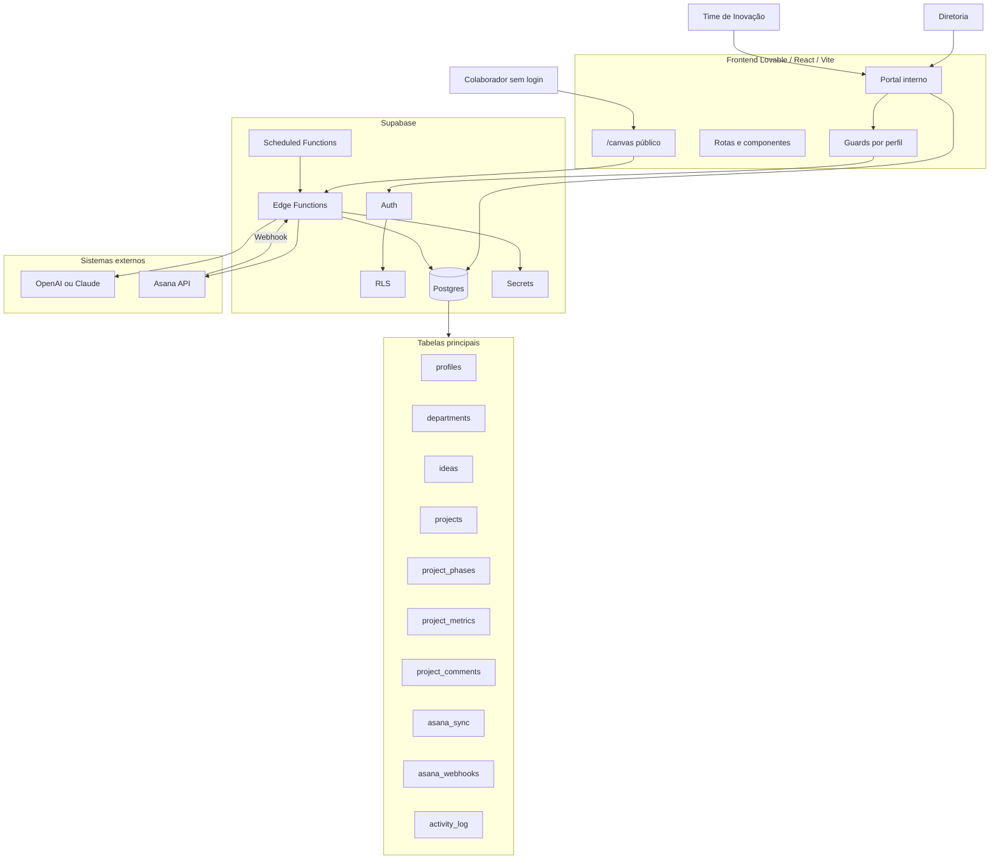
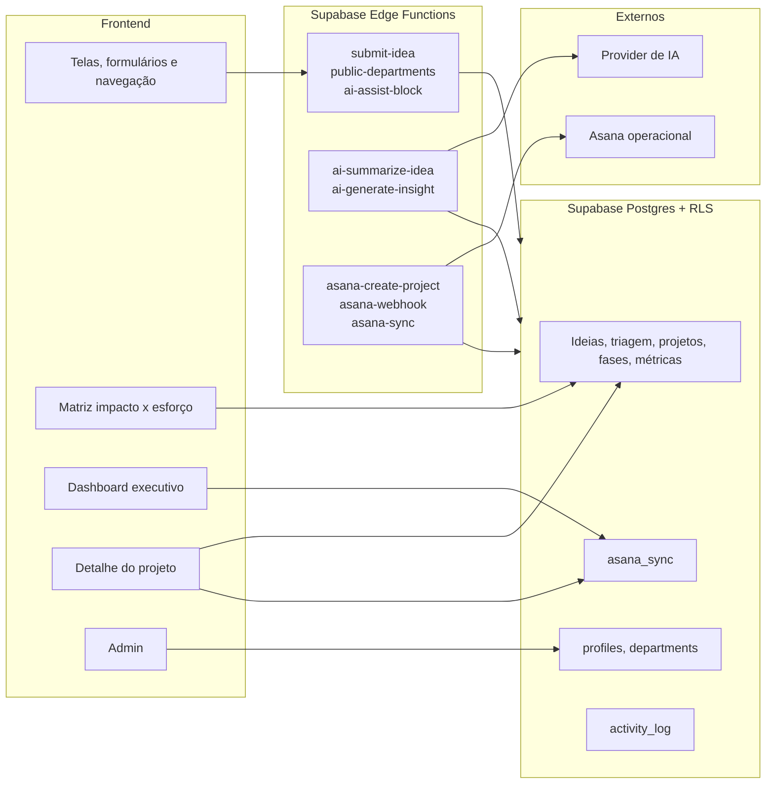
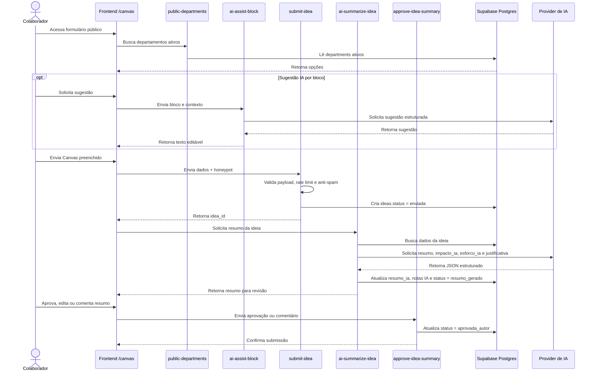
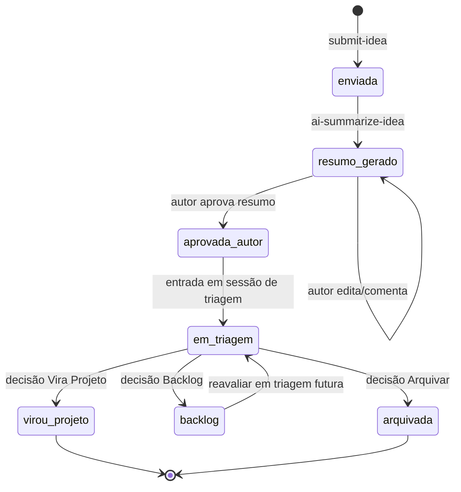
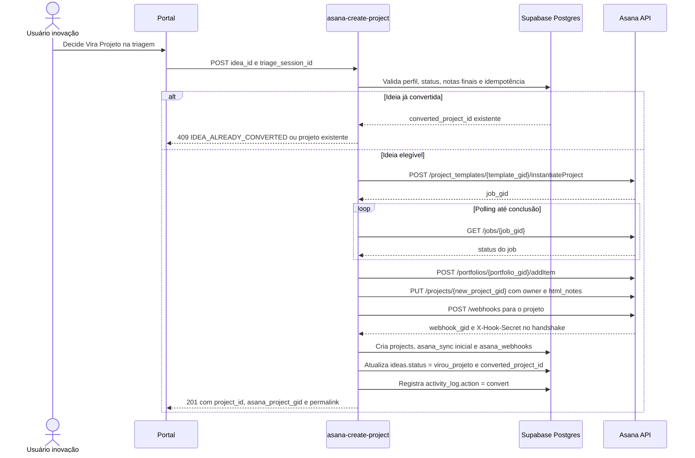
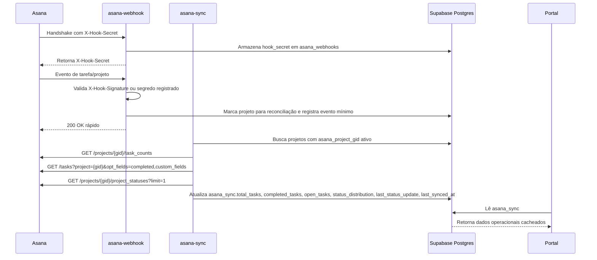
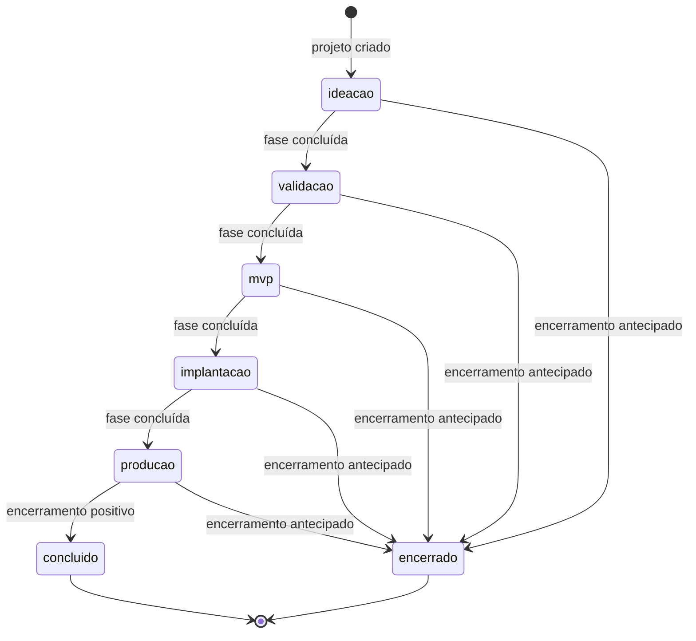
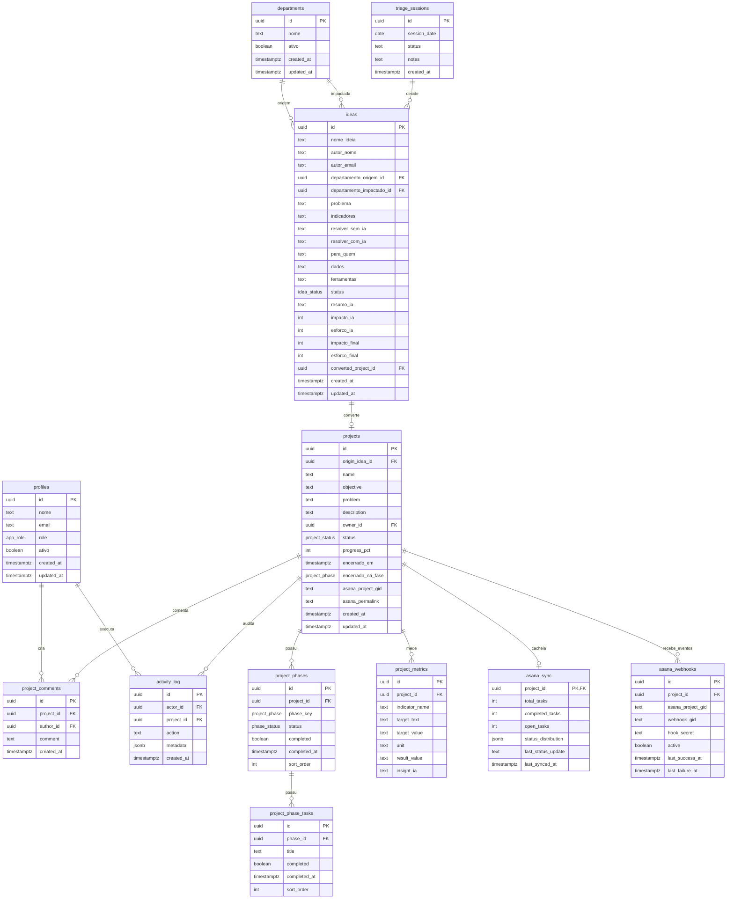

# Design Técnico — Portal de Gestão da Inovação Rennova

> Fonte técnica para implementação, revisão e manutenção do Rennova Spark Hub.  
> Nesta versão, os diagramas Mermaid são tratados como **fonte de verdade técnica** para arquitetura, fluxos, estados e relacionamentos. As tabelas complementam os detalhes que não cabem bem em diagrama.

---

<a id="sumario"></a>
## Sumário

- [1. Identificação do projeto](#dt-1-identificacao-do-projeto)
- [2. Resumo técnico da solução](#dt-2-resumo-tecnico-da-solucao)
- [3. Diagramas técnicos](#dt-3-diagramas-tecnicos)
  - [3.1 Arquitetura geral](#dt-3-1-arquitetura-geral)
  - [3.2 Componentes e responsabilidades](#dt-3-2-componentes-e-responsabilidades)
  - [3.3 Fluxo do Canvas público](#dt-3-3-fluxo-do-canvas-publico)
  - [3.4 Estados da ideia](#dt-3-4-estados-da-ideia)
  - [3.5 Conversão de ideia em projeto Asana](#dt-3-5-conversao-de-ideia-em-projeto-asana)
  - [3.6 Sincronização Asana → Portal](#dt-3-6-sincronizacao-asana-portal)
  - [3.7 Estados e fases do projeto](#dt-3-7-estados-e-fases-do-projeto)
  - [3.8 Modelo de dados principal](#dt-3-8-modelo-de-dados-principal)
  - [3.9 Autenticação e autorização](#dt-3-9-autenticacao-e-autorizacao)
- [4. Stack tecnológica](#dt-4-stack-tecnologica)
- [5. Decisões técnicas](#dt-5-decisoes-tecnicas)
- [6. Modelo de dados](#dt-6-modelo-de-dados)
  - [6.1 Entidades](#dt-6-1-entidades)
  - [6.2 Enums e valores controlados](#dt-6-2-enums-e-valores-controlados)
  - [6.3 Índices e constraints](#dt-6-3-indices-e-constraints)
- [7. Contratos de API / Edge Functions](#dt-7-contratos-de-api-edge-functions)
- [8. Integrações externas](#dt-8-integracoes-externas)
- [9. Autenticação, autorização e RLS](#dt-9-autenticacao-autorizacao-e-rls)
- [10. Tratamento de erros](#dt-10-tratamento-de-erros)
- [11. Logs e observabilidade](#dt-11-logs-e-observabilidade)
- [12. Segurança técnica](#dt-12-seguranca-tecnica)
- [13. Deploy e ambientes](#dt-13-deploy-e-ambientes)
- [14. Variáveis de ambiente](#dt-14-variaveis-de-ambiente)
- [15. Riscos técnicos](#dt-15-riscos-tecnicos)
- [16. Pendências técnicas](#dt-16-pendencias-tecnicas)
- [17. Aprovação técnica](#dt-17-aprovacao-tecnica)

---

<a id="dt-1-identificacao-do-projeto"></a>
## 1. Identificação do projeto

| Campo | Valor |
|---|---|
| Projeto | Rennova Spark Hub — Portal de Gestão da Inovação |
| Responsável técnico | Phablo Tavares |
| Área/Time | Inovação / Desenvolvimento de Agentes e Soluções de IA |
| Data | 2026-07-08 |
| Versão | 0.4 |

---

<a id="dt-2-resumo-tecnico-da-solucao"></a>
## 2. Resumo técnico da solução

Aplicação web React/Vite evoluída prioritariamente via Lovable, com Supabase para Auth, Postgres, RLS e Edge Functions. O sistema terá um Canvas público para submissão de ideias e um portal interno para triagem, priorização, gestão executiva de projetos, métricas e governança. IA e Asana serão acessados somente por Edge Functions. O Supabase será a fonte de verdade do portal; o Asana será usado para execução operacional de tarefas e sprints.

Estado atual conhecido: protótipo visual com rotas principais e dados mockados. Estado alvo: app integrado ao Supabase, com autenticação, RLS, Edge Functions, IA e Asana.

---

<a id="dt-3-diagramas-tecnicos"></a>
## 3. Diagramas técnicos

<a id="dt-3-1-arquitetura-geral"></a>
### 3.1 Arquitetura geral



<a id="dt-3-2-componentes-e-responsabilidades"></a>
### 3.2 Componentes e responsabilidades



<a id="dt-3-3-fluxo-do-canvas-publico"></a>
### 3.3 Fluxo do Canvas público



<a id="dt-3-4-estados-da-ideia"></a>
### 3.4 Estados da ideia



<a id="dt-3-5-conversao-de-ideia-em-projeto-asana"></a>
### 3.5 Conversão de ideia em projeto Asana



<a id="dt-3-6-sincronizacao-asana-portal"></a>
### 3.6 Sincronização Asana → Portal



<a id="dt-3-7-estados-e-fases-do-projeto"></a>
### 3.7 Estados e fases do projeto



Regras do estado do projeto:

| Regra | Definição |
|---|---|
| Fase atual | Primeira fase não concluída ou fase marcada como atual no banco |
| Progresso | Calculado por trigger a partir de `project_phases.completed` |
| Encerramento | Pode ocorrer em qualquer fase e deve gravar `encerrado_em` e `encerrado_na_fase` |
| Checklist | `project_phase_tasks` apoia governança da fase; não substitui tarefas do Asana |

<a id="dt-3-8-modelo-de-dados-principal"></a>
### 3.8 Modelo de dados principal



<a id="dt-3-9-autenticacao-e-autorizacao"></a>
### 3.9 Autenticação e autorização

```mermaid
flowchart TD
    Request[Requisição do usuário] --> Public{Rota pública?}

    Public -->|Sim: /canvas| PublicFlow[Permitir sem login]
    PublicFlow --> PublicFns[Edge Functions públicas com rate limit]

    Public -->|Não| Auth{Sessão Supabase válida?}
    Auth -->|Não| Login[/login]
    Auth -->|Sim| Role{profiles.role ativo?}

    Role -->|diretoria| ReadOnly[Dashboard, matriz e detalhe somente leitura]
    Role -->|inovacao| FullAccess[Triagem, conversão, projetos, métricas, comentários e admin]
    Role -->|inativo/ausente| Forbidden[403]

    ReadOnly --> RLS[RLS + validação no backend]
    FullAccess --> RLS
```

---

<a id="dt-4-stack-tecnologica"></a>
## 4. Stack tecnológica

| Camada | Tecnologia | Versão / status | Uso |
|---|---|---|---|
| Frontend | React | 18.3.1 | Interface |
| Build | Vite | 8.0.0 | Build/dev server |
| Linguagem | TypeScript | 5.8.3 | Tipagem |
| UI | Tailwind CSS + shadcn/Radix | Tailwind 3.4.17 | Design system |
| Gráficos | Recharts | 2.15.4 | Matriz e indicadores |
| Queries | TanStack React Query | 5.83.0 | Cache client-side |
| Backend | Supabase Edge Functions | A confirmar | Integrações e lógica sensível |
| Banco | Supabase Postgres | Managed | Fonte de verdade |
| Auth | Supabase Auth | Managed | Login e sessão |
| Acesso ao banco | Supabase JS Client | A incluir | Queries autenticadas pelo front |
| IA | OpenAI ou Claude | Configurável | Sugestões, resumo e insights |
| Asana | Asana REST API | v1 | Projetos, tarefas, webhooks e sync |
| Front deploy | Lovable | A confirmar | Publicação do app |
| Backend deploy | Supabase CLI/Dashboard | A confirmar | Functions, secrets e cron |
| Logs | Supabase logs + `activity_log` | A confirmar | Diagnóstico e auditoria |

---

<a id="dt-5-decisoes-tecnicas"></a>
## 5. Decisões técnicas

| ID | Decisão | Justificativa | Impactos |
|---|---|---|---|
| DT001 | Lovable será a fonte principal do front-end. | Preserva evolução visual e reduz risco de incompatibilidade com o Lovable. | Edições externas no front devem ser evitadas; alterações devem ser incrementais e validadas. |
| DT002 | Supabase será a fonte de verdade do portal. | Centraliza Auth, RLS, Postgres e Edge Functions. | Governança, ideias, projetos, métricas e cache Asana ficam no Supabase. |
| DT003 | Asana, IA e operações públicas sensíveis serão acessadas apenas por Edge Functions. | Evita exposição de tokens e `service_role` no front-end. | Todas as funções devem validar entrada, permissão e logs. |
| DT004 | Asana será ferramenta operacional, não fonte de governança. | Evita duplicar impacto, esforço, áreas e decisões estratégicas no Asana. | Portal exibe dados Asana em leitura; Supabase guarda governança. |
| DT005 | Dashboard e detalhe lerão Asana via `asana_sync`. | Evita lentidão, falhas e rate limit no carregamento. | Pode haver defasagem; UI deve exibir `last_synced_at`. |
| DT006 | Sincronização Asana usará webhook + cron. | Webhook dá atualização rápida; cron garante consistência. | Criar webhook por projeto e armazenar segredo por projeto. |
| DT007 | Provider de IA será configurável por `AI_PROVIDER`. | Permite troca entre OpenAI/Claude sem refatorar fluxo. | Edge Functions devem normalizar JSON e tratar resposta inválida. |
| DT008 | Impacto e esforço usarão escala 1–5. | Alinha com schema e simplifica priorização. | Ajustar matriz atual que usa escala visual 0–10. |
| DT009 | Não criar custom fields de projeto no Asana. | Dados estratégicos pertencem ao Supabase. | Asana recebe contexto em `html_notes`; não duplica governança. |
| DT010 | Ações relevantes serão registradas em `activity_log`. | Dá rastreabilidade funcional com baixo custo. | Não registrar tokens, secrets ou dados sensíveis. |

---

<a id="dt-6-modelo-de-dados"></a>
## 6. Modelo de dados

O ERD da seção [3.8](#dt-3-8-modelo-de-dados-principal) é a fonte de verdade para relacionamentos. As tabelas abaixo complementam campos, finalidade e cuidados de implementação.

<a id="dt-6-1-entidades"></a>
### 6.1 Entidades

| Entidade | Finalidade | Campos principais | Observações |
|---|---|---|---|
| `profiles` | Perfil interno vinculado ao Supabase Auth | `id`, `nome`, `email`, `role`, `ativo` | `role` não deve ser alterável pelo próprio usuário. |
| `departments` | Áreas de origem/impacto | `id`, `nome`, `ativo` | Canvas público deve ler apenas departamentos ativos via Edge Function ou policy restrita. |
| `ideas` | Ideias submetidas no Canvas e triadas internamente | Dados do Canvas, `status`, `resumo_ia`, notas IA/finais, `converted_project_id` | Nota de impacto/esforço nunca aparece para o autor. |
| `triage_sessions` | Sessões mensais de triagem | `session_date`, `status`, `notes` | Registra decisões de priorização. |
| `projects` | Projetos de inovação derivados de ideia ou criados internamente | `origin_idea_id`, `name`, `status`, `progress_pct`, `asana_project_gid`, `asana_permalink` | Mantém governança executiva; Asana cuida das tarefas. |
| `project_phases` | Fases executivas do projeto | `project_id`, `phase_key`, `status`, `completed`, `sort_order` | Base para cálculo de progresso. |
| `project_phase_tasks` | Checklist leve da fase | `phase_id`, `title`, `completed`, `sort_order` | Não substitui tarefas operacionais do Asana. |
| `project_metrics` | Indicadores, metas, resultados e insights | `indicator_name`, `target_*`, `result_value`, `insight_ia` | Insight só deve ser gerado quando houver resultado. |
| `project_comments` | Comentários de governança | `project_id`, `author_id`, `comment` | Comentários operacionais ficam no Asana. |
| `asana_sync` | Cache operacional do Asana | `total_tasks`, `completed_tasks`, `open_tasks`, `status_distribution`, `last_synced_at` | Fonte de leitura do dashboard para dados Asana. |
| `asana_webhooks` | Controle dos webhooks Asana por projeto | `project_id`, `webhook_gid`, `hook_secret`, `active` | Recomendado para não depender de um secret único global. |
| `activity_log` | Auditoria funcional | `actor_id`, `project_id`, `action`, `metadata` | Sem tokens, secrets ou payloads sensíveis. |

<a id="dt-6-2-enums-e-valores-controlados"></a>
### 6.2 Enums e valores controlados

| Enum | Valores | Uso |
|---|---|---|
| `app_role` | `diretoria`, `inovacao` | Autorização interna |
| `idea_status` | `enviada`, `resumo_gerado`, `aprovada_autor`, `em_triagem`, `backlog`, `virou_projeto`, `arquivada` | Estado da ideia |
| `project_phase` | `ideacao`, `validacao`, `mvp`, `implantacao`, `producao` | Fases executivas |
| `phase_status` | `pendente`, `em_andamento`, `concluida` | Status da fase |
| `project_status` | `no_prazo`, `em_risco`, `atrasado`, `concluido`, `encerrado` | Status executivo |

<a id="dt-6-3-indices-e-constraints"></a>
### 6.3 Índices e constraints

| Item | Campo(s) | Tipo | Finalidade |
|---|---|---|---|
| `profiles_pkey` | `id` | PK | Identificação do usuário |
| `departments_nome_unique` | `nome` | Unique recomendado | Evitar áreas duplicadas |
| `ideas_status_idx` | `status` | Index | Filtros de triagem/matriz |
| `ideas_created_at_idx` | `created_at` | Index | Listagem por período |
| `ideas_converted_project_unique` | `converted_project_id` | Unique recomendado | Evitar dupla conversão |
| `projects_origin_idea_unique` | `origin_idea_id` | Unique recomendado | Uma ideia gera no máximo um projeto |
| `projects_asana_project_gid_unique` | `asana_project_gid` | Unique recomendado | Evitar duplicidade Asana |
| `project_phases_project_order_idx` | `project_id`, `sort_order` | Index | Ordenação das fases |
| `asana_sync_pkey` | `project_id` | PK/FK | Um cache por projeto |
| `asana_webhooks_webhook_gid_unique` | `webhook_gid` | Unique recomendado | Controle de webhooks |
| `activity_log_project_idx` | `project_id`, `created_at` | Index | Auditoria por projeto |
| Check notas | `impacto_ia`, `esforco_ia`, `impacto_final`, `esforco_final` entre 1 e 5 | Check | Consistência da matriz |

---

<a id="dt-7-contratos-de-api-edge-functions"></a>
## 7. Contratos de API / Edge Functions

Leituras e CRUD simples autenticados podem usar Supabase Client com RLS. Operações públicas, integrações e lógica sensível devem passar por Edge Functions.

| ID | Método / endpoint | Auth | Permissão | Entrada principal | Saída principal | Erros esperados |
|---|---|---|---|---|---|---|
| API001 | `GET /functions/v1/public-departments` | Não | Pública | Sem body | `{ departments: [{ id, nome }] }` | `DEPARTMENTS_FETCH_FAILED` |
| API002 | `POST /functions/v1/submit-idea` | Não | Pública com anti-spam | Dados do Canvas + `honeypot` | `{ idea_id, status: "enviada" }` | `VALIDATION_ERROR`, `RATE_LIMITED`, `IDEA_SUBMIT_FAILED` |
| API003 | `POST /functions/v1/ai-assist-block` | Não | Pública com rate limit | `block`, `context` | `{ suggestion }` | `INVALID_BLOCK`, `RATE_LIMITED`, `AI_PROVIDER_ERROR` |
| API004 | `POST /functions/v1/ai-summarize-idea` | Condicional | Fluxo da própria ideia ou server-side | `idea_id`, token se aplicável | `{ idea_id, resumo_ia, status }` | `FORBIDDEN`, `IDEA_NOT_FOUND`, `AI_PROVIDER_ERROR` |
| API005 | `POST /functions/v1/approve-idea-summary` | Não, com token temporário | Autor da submissão | `idea_id`, `approval_token`, `comentario_autor` | `{ idea_id, status: "aprovada_autor" }` | `FORBIDDEN`, `INVALID_STATUS_TRANSITION` |
| API006 | `POST /functions/v1/asana-create-project` | Sim | `inovacao` | `idea_id`, `triage_session_id` | `{ project_id, asana_project_gid, asana_permalink }` | `IDEA_ALREADY_CONVERTED`, `ASANA_PROVIDER_ERROR` |
| API007 | `POST /functions/v1/asana-webhook` | Não | Validação por header/assinatura | Headers Asana + eventos | `200 OK`; no handshake devolve `X-Hook-Secret` | `INVALID_WEBHOOK_SIGNATURE`, `INVALID_WEBHOOK_PAYLOAD` |
| API008 | `POST /functions/v1/asana-sync` | Sim ou secret interno | `inovacao` ou cron | `project_id` opcional | `{ synced, failed }` | `FORBIDDEN`, `ASANA_PROVIDER_ERROR`, `ASANA_SYNC_FAILED` |
| API009 | `POST /functions/v1/ai-generate-insight` | Sim | `inovacao` | `metric_id` | `{ metric_id, insight_ia }` | `MISSING_RESULT`, `METRIC_NOT_FOUND`, `AI_PROVIDER_ERROR` |

### Payloads principais

#### `submit-idea`

```json
{
  "nome_ideia": "Automação de atendimento",
  "autor_nome": "Nome do autor",
  "autor_email": "autor@rennova.com.br",
  "departamento_origem_id": "uuid",
  "departamento_impactado_id": "uuid",
  "problema": "Texto",
  "indicadores": "Texto",
  "resolver_sem_ia": "Texto",
  "resolver_com_ia": "Texto",
  "para_quem": "Texto",
  "dados": "Texto opcional",
  "ferramentas": "Texto opcional",
  "honeypot": ""
}
```

#### `asana-create-project`

```json
{
  "idea_id": "uuid",
  "triage_session_id": "uuid"
}
```

#### `asana-webhook`

```json
{
  "events": [
    {
      "resource": { "gid": "asana_project_gid" },
      "action": "changed",
      "created_at": "2026-07-08T12:00:00Z"
    }
  ]
}
```

### Padrão de resposta de erro

```json
{
  "error": {
    "code": "ERROR_CODE",
    "message": "Mensagem clara para diagnóstico"
  }
}
```

---

<a id="dt-8-integracoes-externas"></a>
## 8. Integrações externas

| Integração | Direção | Autenticação | Responsabilidade | Cuidados |
|---|---|---|---|---|
| Asana | Bidirecional | `ASANA_TOKEN` em Supabase Secret | Criar projeto, adicionar a portfólio, criar webhook, sincronizar tarefas/status | Nunca chamar pelo front; tratar job assíncrono, rate limit, webhook e cron. |
| IA | Portal → Provider | `OPENAI_API_KEY` ou `ANTHROPIC_API_KEY` em Secret | Sugestões do Canvas, resumo da ideia, notas IA e insights | Pedir JSON estruturado, validar parse, não confiar cegamente na resposta. |

### Endpoints Asana usados

| Uso | Endpoint |
|---|---|
| Instanciar template | `POST /project_templates/{ASANA_TEMPLATE_GID}/instantiateProject` |
| Consultar job | `GET /jobs/{job_gid}` |
| Adicionar ao portfólio | `POST /portfolios/{ASANA_PORTFOLIO_GID}/addItem` |
| Atualizar projeto | `PUT /projects/{project_gid}` |
| Criar webhook | `POST /webhooks` |
| Contagem de tarefas | `GET /projects/{gid}/task_counts` |
| Distribuição por status | `GET /tasks?project={gid}&opt_fields=completed,custom_fields.name,custom_fields.enum_value.name` |
| Último status update | `GET /projects/{gid}/project_statuses?limit=1` |

---

<a id="dt-9-autenticacao-autorizacao-e-rls"></a>
## 9. Autenticação, autorização e RLS

| Perfil | Acesso permitido | Restrições |
|---|---|---|
| Público | `/canvas`, sugestões IA limitadas, submissão de ideia e aprovação por token/sessão | Não acessa portal interno; não vê impacto/esforço. |
| `diretoria` | Dashboard, matriz e detalhe de projeto em leitura | Não triagem, não converte projeto, não edita, não administra usuários. |
| `inovacao` | Gestão completa: triagem, projetos, fases, métricas, comentários, conversão Asana e admin | Ações sensíveis devem ser validadas também no backend. |

Regras obrigatórias:

- Rotas internas exigem sessão Supabase válida.
- `profiles.ativo = false` bloqueia acesso.
- RLS deve proteger leitura e escrita no banco.
- Edge Functions autenticadas devem validar JWT e perfil no servidor.
- Funções públicas devem usar rate limit, validação de entrada e escopo mínimo.
- `service_role` só pode ser usado em Edge Functions e apenas quando necessário.

---

<a id="dt-10-tratamento-de-erros"></a>
## 10. Tratamento de erros

| Camada | Situação | Comportamento esperado |
|---|---|---|
| Frontend | Campo inválido | Bloquear envio e indicar campo/motivo. |
| Frontend | Falha de rede | Exibir mensagem de tentativa posterior sem perder dados digitados quando possível. |
| Frontend | Sem permissão | Exibir acesso negado e não renderizar ações restritas. |
| Edge Function | Payload inválido | Retornar `400` com `VALIDATION_ERROR`. |
| Edge Function | Usuário sem sessão | Retornar `401` com `UNAUTHENTICATED`. |
| Edge Function | Perfil sem permissão | Retornar `403` com `FORBIDDEN`. |
| Edge Function | Conflito de estado | Retornar `409` com código específico, ex.: `IDEA_ALREADY_CONVERTED`. |
| Integração | Asana/IA indisponível | Retornar `502`, registrar log técnico e preservar consistência local. |
| Integração | Falha parcial de sync | Registrar falha, manter último cache válido e permitir reconciliação posterior. |

---

<a id="dt-11-logs-e-observabilidade"></a>
## 11. Logs e observabilidade

| Evento | Onde registrar | Observação |
|---|---|---|
| Submissão de ideia | Edge logs + opcional `activity_log` | Sem payload sensível completo. |
| Aprovação de resumo | `activity_log` | Registrar `idea_id` e ação. |
| Decisão de triagem | `activity_log` | Registrar decisão e sessão. |
| Conversão em projeto | `activity_log` | Registrar `idea_id`, `project_id`, `asana_project_gid`. |
| Erro Asana | Edge logs + `activity_log` se afetar fluxo funcional | Não registrar token. |
| Erro IA | Edge logs | Registrar código e contexto mínimo. |
| Alteração de fase/métrica/comentário | `activity_log` | Registrar ator e registro afetado. |

Não registrar: senhas, tokens, API keys, `service_role`, secrets de webhook, payloads completos com dados pessoais ou textos sensíveis desnecessários.

---

<a id="dt-12-seguranca-tecnica"></a>
## 12. Segurança técnica

| Controle | Obrigatório? | Aplicação |
|---|---:|---|
| HTTPS | Sim | Portal, Supabase e webhooks |
| RLS | Sim | Todas as tabelas expostas ao client |
| Validação server-side | Sim | Todas as Edge Functions |
| Secrets fora do front | Sim | Asana, IA, Supabase service role, webhook secrets |
| Rate limit | Sim | `/canvas`, IA pública e submissão pública |
| Anti-spam | Sim | `submit-idea` com honeypot e limite por IP/e-mail |
| Sanitização de HTML | Sim | `html_notes` do Asana e textos vindos da IA |
| Idempotência | Sim | Conversão ideia → projeto Asana |
| Auditoria mínima | Sim | Ações funcionais críticas |

---

<a id="dt-13-deploy-e-ambientes"></a>
## 13. Deploy e ambientes

| Ambiente | Responsável | Finalidade | Observações |
|---|---|---|---|
| Desenvolvimento Lovable | Lovable | Evolução visual e funcional do front | Evitar edição externa direta no front. |
| Supabase Dev/Homolog | Supabase | Testar banco, RLS, Edge Functions e integrações | Usar secrets de teste. |
| Produção | Lovable + Supabase | Uso real | Configurar domínio, secrets reais e monitoramento mínimo. |

Processo recomendado:

1. Alterar front pelo Lovable.
2. Versionar/sincronizar no GitHub.
3. Aplicar migrations Supabase.
4. Publicar Edge Functions.
5. Configurar secrets.
6. Validar fluxo completo em homologação.
7. Publicar produção.

Rollback:

- Frontend: retornar versão/commit anterior compatível com Lovable.
- Banco: usar migration reversível quando aplicável; evitar mudanças destrutivas sem backup.
- Edge Functions: republicar versão anterior.
- Integrações: desativar webhook/cron se causar instabilidade.

---

<a id="dt-14-variaveis-de-ambiente"></a>
## 14. Variáveis de ambiente

| Variável | Obrigatória? | Uso | Exemplo seguro |
|---|---:|---|---|
| `VITE_SUPABASE_URL` | Sim | Frontend | `https://project.supabase.co` |
| `VITE_SUPABASE_ANON_KEY` | Sim | Frontend com RLS | `anon_public_key` |
| `SUPABASE_URL` | Sim | Edge Functions | `https://project.supabase.co` |
| `SUPABASE_SERVICE_ROLE_KEY` | Sim | Edge Functions com privilégios controlados | `***` |
| `AI_PROVIDER` | Sim | Selecionar IA | `openai` ou `claude` |
| `OPENAI_API_KEY` | Condicional | IA OpenAI | `***` |
| `ANTHROPIC_API_KEY` | Condicional | IA Claude | `***` |
| `ASANA_TOKEN` | Sim | Asana API | `***` |
| `ASANA_TEMPLATE_GID` | Sim | Template Asana | `1215808313871106` |
| `ASANA_PORTFOLIO_GID` | Sim | Portfólio Inovação | `1213936811318686` |
| `ASANA_WORKSPACE_GID` | Sim | Workspace Rennova | `1202773865285599` |
| `ASANA_DEFAULT_OWNER` | Sim | Owner padrão do projeto | `1211426908652574` |
| `CRON_SECRET` | Sim | Execução agendada/manual protegida | `***` |
| `PUBLIC_RATE_LIMIT_*` | Recomendado | Rate limit de endpoints públicos | `60/min` |

---

<a id="dt-15-riscos-tecnicos"></a>
## 15. Riscos técnicos

| ID | Risco | Impacto | Probabilidade | Mitigação |
|---|---|---|---|---|
| RT001 | Edição externa quebrar continuidade com Lovable | Alto | Média | Usar Lovable como fonte principal do front; isolar backend em Supabase. |
| RT002 | RLS mal configurado expor dados internos | Alto | Média | Revisar policies e testar perfis público/diretoria/inovacao. |
| RT003 | Conversão duplicada no Asana | Alto | Média | Idempotência, unique constraints e transação/lock na conversão. |
| RT004 | Webhook Asana perder eventos | Médio | Média | Manter cron `asana-sync` como reconciliação. |
| RT005 | IA retornar JSON inválido ou resposta inadequada | Médio | Média | Validar schema, fallback e logs. |
| RT006 | Token/secret exposto por erro de implementação | Alto | Baixa/Média | Secrets só em Edge Functions; revisão de logs e repositório. |
| RT007 | Defasagem perceptível no dashboard | Baixo/Médio | Média | Exibir `last_synced_at` e permitir sync manual para inovação. |

---

<a id="dt-16-pendencias-tecnicas"></a>
## 16. Pendências técnicas

| ID | Pendência | Encaminhamento | Status |
|---|---|---|---|
| PT001 | Confirmar domínio/URL final do portal | Definir antes de produção | Aberta |
| PT002 | Confirmar se haverá ambiente separado de homologação | Recomendado para testar Asana/IA sem dados reais | Aberta |
| PT003 | Definir estratégia exata do token de aprovação do autor | Sessão imediata ou token temporário com hash | Aberta |
| PT004 | Revisar policies RLS do schema final | Obrigatório antes de produção | Aberta |
| PT005 | Confirmar suporte do renderizador Markdown usado para Mermaid | Necessário para diagramas renderizarem no destino final | Aberta |
| PT006 | Confirmar se `asana_webhooks` será adicionada ao schema | Recomendado para webhook por projeto | Aberta |

---

<a id="dt-17-aprovacao-tecnica"></a>
## 17. Aprovação técnica

| Papel | Nome | Data | Aprovação |
|---|---|---|---|
| Responsável técnico |  |  |  |
| Desenvolvimento |  |  |  |
| Solicitante / Dono do produto |  |  |  |