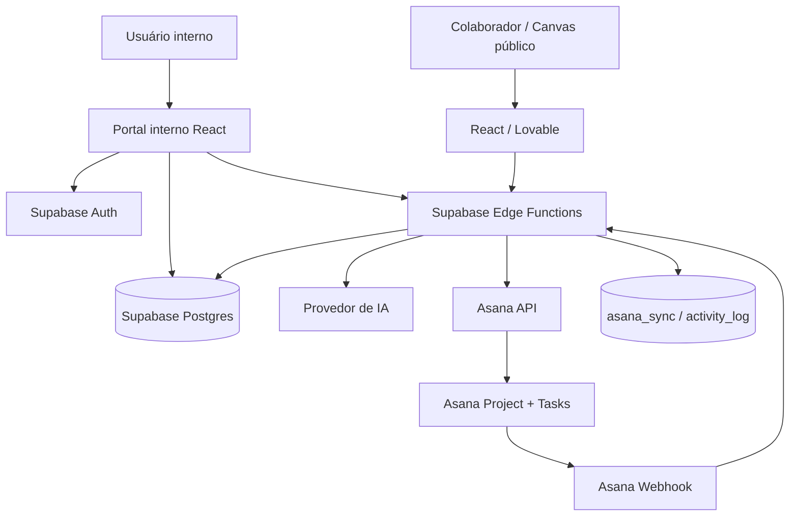
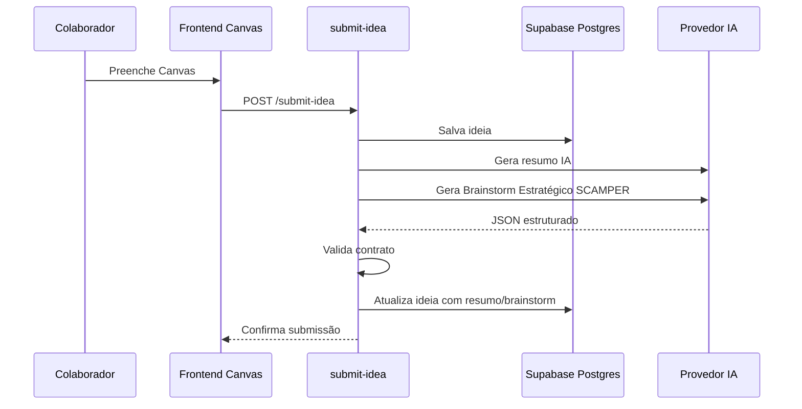
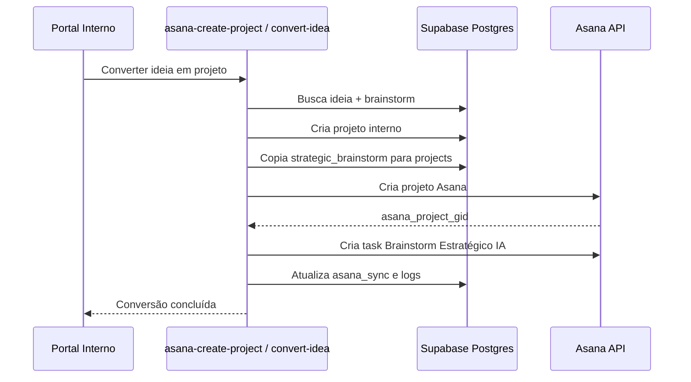
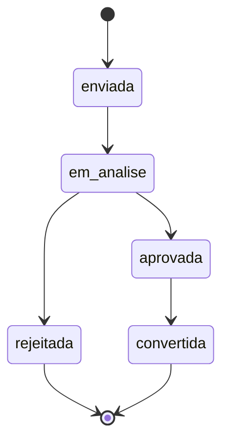
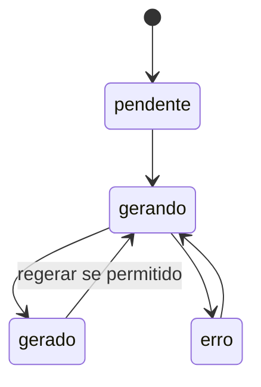

# Design Técnico — Portal de Gestão da Inovação Rennova

> Fonte técnica para implementação, revisão e manutenção do **Rennova Spark Hub**.  
> Versão consolidada com a funcionalidade de **Brainstorm Estratégico com IA baseado em SCAMPER**, persistência em Supabase, contrato JSON, escala 1–10 de impacto/esforço e criação de task inicial no Asana.

---

<a id="sumario"></a>
## Sumário

- [1. Identificação do projeto](#dt-1-identificacao-do-projeto)
- [2. Resumo técnico da solução](#dt-2-resumo-tecnico-da-solucao)
- [3. Arquitetura e fluxos técnicos](#dt-3-arquitetura-e-fluxos-tecnicos)
- [4. Stack tecnológica](#dt-4-stack-tecnologica)
- [5. Decisões técnicas](#dt-5-decisoes-tecnicas)
- [6. Modelo de dados](#dt-6-modelo-de-dados)
- [7. Contratos de API / Edge Functions](#dt-7-contratos-de-api-edge-functions)
- [8. Integrações externas](#dt-8-integracoes-externas)
- [9. Autenticação, autorização e RLS](#dt-9-autenticacao-autorizacao-e-rls)
- [10. Tratamento de erros](#dt-10-tratamento-de-erros)
- [11. Logs e observabilidade](#dt-11-logs-e-observabilidade)
- [12. Segurança técnica](#dt-12-seguranca-tecnica)
- [13. Deploy e ambientes](#dt-13-deploy-e-ambientes)
- [14. Variáveis de ambiente](#dt-14-variaveis-de-ambiente)
- [15. Riscos técnicos](#dt-15-riscos-tecnicos)
- [16. Pendências técnicas](#dt-16-pendencias-tecnicas)
- [17. Aprovação técnica](#dt-17-aprovacao-tecnica)

---

<a id="dt-1-identificacao-do-projeto"></a>
## 1. Identificação do projeto

| Campo | Valor |
|---|---|
| Nome do projeto | Rennova Spark Hub — Portal de Gestão da Inovação |
| Responsável técnico | Phablo Tavares |
| Área/Time | Inovação / Desenvolvimento de Agentes e Soluções de IA |
| Data | 2026-07-08 |
| Versão | 0.4 |
| Alteração desta versão | Inclusão técnica do Brainstorm Estratégico IA, SCAMPER, modelo de dados, API, matriz 1–10 e task inicial no Asana |

---

<a id="dt-2-resumo-tecnico-da-solucao"></a>
## 2. Resumo técnico da solução

Aplicação web em React/Vite, evoluída prioritariamente via Lovable, com Supabase para autenticação, Postgres, RLS e Edge Functions.

O portal terá:

- rota pública para submissão de ideias;
- rotas internas autenticadas para gestão do portfólio;
- IA para sugestões de Canvas, resumo, brainstorm estratégico e insights;
- Supabase como fonte de verdade de governança;
- Asana como ferramenta operacional de execução;
- sincronização Asana → Portal por webhook e cron;
- Brainstorm Estratégico com IA baseado em SCAMPER, salvo na ideia, herdado pelo projeto e enviado ao Asana em task inicial.

Chamadas a IA e Asana serão feitas exclusivamente por Supabase Edge Functions. Nenhum token externo deve ser exposto no front-end.

---

<a id="dt-3-arquitetura-e-fluxos-tecnicos"></a>
## 3. Arquitetura e fluxos técnicos

### 3.1 Arquitetura geral



### 3.2 Fluxo técnico de submissão de ideia



### 3.3 Fluxo técnico do Brainstorm Estratégico IA

```text
Ideia salva
  -> Edge Function ai-generate-strategic-brainstorm
  -> Monta prompt com dados da ideia e instruções SCAMPER
  -> Chama provider de IA
  -> Recebe JSON com 3 soluções
  -> Valida schema e regras mínimas
  -> Define solução recomendada
  -> Usa notas da recomendada para impacto/esforço/quadrante inicial
  -> Persiste strategic_brainstorm em ideas
```

### 3.4 Fluxo técnico de conversão em projeto e Asana



### 3.5 Estados da ideia



### 3.6 Estados do brainstorm



---

<a id="dt-4-stack-tecnologica"></a>
## 4. Stack tecnológica

| Camada | Tecnologia | Observação |
|---|---|---|
| Frontend | React, Vite, TypeScript | Stack atual do projeto Lovable |
| UI | Tailwind, shadcn/Radix, Recharts | Design visual e matriz Impacto × Esforço |
| Estado/queries | TanStack React Query | Cache e queries client-side |
| Backend | Supabase Edge Functions | Regras sensíveis, IA, Asana e validações server-side |
| Banco | Supabase Postgres | Fonte de verdade do portal |
| Autenticação | Supabase Auth | Login interno |
| Autorização | Supabase RLS + Edge Functions | Controle por perfil |
| IA | OpenAI ou Claude | Provider configurável por secret |
| Asana | Asana REST API + Webhooks | Projetos, tasks e sincronização operacional |
| Logs | `activity_log` + logs Edge Functions | Auditoria e troubleshooting |
| Deploy frontend | Lovable | Publicação do app |
| Deploy backend | Supabase | Edge Functions, DB, Auth e secrets |

---

<a id="dt-5-decisoes-tecnicas"></a>
## 5. Decisões técnicas

| Código | Decisão | Justificativa |
|---|---|---|
| DT001 | Lovable como fonte principal do front-end | Preserva fluxo de evolução visual e reduz risco de conflito com o protótipo. |
| DT002 | Supabase como fonte de verdade do portal | Centraliza governança, auditoria, RLS e dados internos. |
| DT003 | Chamadas externas somente via Edge Functions | Protege tokens e permite validação server-side. |
| DT004 | Asana como ferramenta operacional, não fonte de governança | Portal mantém visão executiva e rastreabilidade; Asana executa tasks. |
| DT005 | Dashboard baseado em dados cacheados | Evita depender de Asana em tempo real. |
| DT006 | Webhook + cron para sincronização Asana | Webhook dá agilidade; cron corrige divergências. |
| DT007 | Provider de IA configurável | Permite trocar OpenAI/Claude sem alterar front-end. |
| DT008 | Escala de priorização 1–10 | Dá granularidade suficiente para impacto/esforço e matriz. |
| DT009 | SCAMPER como framework de brainstorm | Simples, objetivo e adequado para gerar alternativas práticas. |
| DT010 | Brainstorm em JSONB | Flexível para armazenar soluções, notas, riscos e recomendação sem multiplicar tabelas no MVP. |
| DT011 | Task inicial no Asana para brainstorm | Mantém descrição do projeto limpa e garante rastreabilidade operacional. |
| DT012 | Logs funcionais em `activity_log` | Permite auditoria de ações críticas sem expor dados sensíveis. |

---

<a id="dt-6-modelo-de-dados"></a>
## 6. Modelo de dados

### 6.1 Entidades principais

| Entidade | Responsabilidade |
|---|---|
| `profiles` | Perfil interno do usuário e papel de acesso. |
| `departments` | Áreas/departamentos disponíveis para ideias. |
| `ideas` | Ideias submetidas, triagem, impacto/esforço, resumo IA e brainstorm. |
| `projects` | Projetos convertidos a partir de ideias ou criados internamente. |
| `project_phases` | Fases do projeto. |
| `project_phase_tasks` | Checklist executivo por fase. |
| `project_metrics` | Métricas e resultados do projeto. |
| `project_comments` | Comentários de governança. |
| `asana_sync` | Cache de dados operacionais vindos do Asana. |
| `triage_sessions` | Rodadas/períodos de triagem. |
| `activity_log` | Log funcional e auditoria. |
| `asana_webhooks` | Controle de webhooks, eventos e reconciliação. |

### 6.2 Campos recomendados em `ideas`

| Campo | Tipo sugerido | Observação |
|---|---|---|
| `id` | uuid | Identificador da ideia. |
| `title` | text | Título da ideia. |
| `description` | text | Descrição original. |
| `origin_department_id` | uuid | Área de origem. |
| `impacted_department_id` | uuid | Área impactada. |
| `author_name` | text | Autor da ideia. |
| `author_email` | text | E-mail do autor. |
| `status` | enum/text | `enviada`, `em_analise`, `aprovada`, `rejeitada`, `convertida`. |
| `impact_score` | numeric/int | Nota 1–10. Inicialmente pode vir da solução recomendada. |
| `effort_score` | numeric/int | Nota 1–10. Inicialmente pode vir da solução recomendada. |
| `quadrant` | enum/text | Quadrante da matriz. |
| `ai_summary` | text | Resumo consolidado da ideia por IA. |
| `ai_classification` | text | Classificação textual da IA. |
| `strategic_brainstorm` | jsonb | Brainstorm completo gerado pela IA. |
| `brainstorm_status` | enum/text | `pendente`, `gerando`, `gerado`, `erro`. |
| `brainstorm_generated_at` | timestamptz | Data/hora da geração. |
| `recommended_solution_id` | text | ID da solução recomendada. |
| `created_at` | timestamptz | Criação. |
| `updated_at` | timestamptz | Atualização. |

### 6.3 Campos recomendados em `projects`

| Campo | Tipo sugerido | Observação |
|---|---|---|
| `id` | uuid | Identificador do projeto. |
| `origin_idea_id` | uuid | Vínculo com a ideia original. |
| `name` | text | Nome do projeto. |
| `area` | text/uuid | Área responsável. |
| `sponsor` | text | Sponsor. |
| `responsible_user_id` | uuid | Responsável interno. |
| `status` | enum/text | Status executivo. |
| `phase` | enum/text | Fase atual. |
| `objective` | text | Objetivo. |
| `problem` | text | Problema. |
| `description` | text | Descrição. |
| `strategic_brainstorm` | jsonb | Cópia do brainstorm no momento da conversão. |
| `recommended_solution_id` | text | Solução recomendada herdada da ideia. |
| `asana_project_gid` | text | ID do projeto Asana. |
| `created_at` | timestamptz | Criação. |
| `updated_at` | timestamptz | Atualização. |

### 6.4 Estrutura JSON do Brainstorm Estratégico

```ts
interface StrategicBrainstorm {
  status: "pendente" | "gerando" | "gerado" | "erro";
  framework: "SCAMPER";
  generatedAt?: string;
  recommendedSolutionId?: string;
  recommendationReason?: string;
  solutions: BrainstormSolution[];
  errorMessage?: string;
}

interface BrainstormSolution {
  id: string;
  title: string;
  scamperApproach:
    | "substituir"
    | "combinar"
    | "adaptar"
    | "modificar"
    | "propor_outro_uso"
    | "eliminar"
    | "reorganizar";
  description: string;
  strategicRationale: string;
  demandResolution: string;
  impactScore: number;
  impactJustification: string;
  effortScore: number;
  effortJustification: string;
  viabilityAnalysis: string;
  risks: string[];
  mitigations: string[];
}
```

### 6.5 Enums e valores controlados

| Enum | Valores |
|---|---|
| `user_role` | `diretoria`, `inovacao` |
| `idea_status` | `enviada`, `em_analise`, `aprovada`, `rejeitada`, `convertida` |
| `project_status` | `no_prazo`, `em_risco`, `atrasado`, `concluido` |
| `project_phase` | `ideacao`, `validacao`, `mvp`, `implantacao`, `producao` |
| `brainstorm_status` | `pendente`, `gerando`, `gerado`, `erro` |
| `scamper_approach` | `substituir`, `combinar`, `adaptar`, `modificar`, `propor_outro_uso`, `eliminar`, `reorganizar` |
| `idea_quadrant` | `oportunidade_imediata`, `grande_projeto`, `ganho_tatico_astuto`, `retorno_limitado`, `baixa_atratividade` |

### 6.6 Índices e constraints recomendados

- Índice em `ideas.status`.
- Índice em `ideas.quadrant`.
- Índice em `ideas.created_at`.
- Índice em `projects.origin_idea_id`.
- Índice único opcional em `projects.origin_idea_id` para impedir dupla conversão.
- Constraint para `impact_score` entre 1 e 10.
- Constraint para `effort_score` entre 1 e 10.
- Constraint para `brainstorm_status` em valores controlados.
- Índice em `asana_sync.asana_gid`.
- Índice em `activity_log.entity_type`, `entity_id` e `created_at`.

---

<a id="dt-7-contratos-de-api-edge-functions"></a>
## 7. Contratos de API / Edge Functions

### API001 - `GET /functions/v1/public-departments`

Retorna departamentos ativos para o Canvas público.

### API002 - `POST /functions/v1/submit-idea`

Responsável por validar e salvar ideia pública.

Entrada mínima:

```json
{
  "authorName": "string",
  "authorEmail": "string",
  "originDepartmentId": "uuid",
  "impactedDepartmentId": "uuid",
  "title": "string",
  "canvas": {}
}
```

Saída esperada:

```json
{
  "ideaId": "uuid",
  "status": "enviada",
  "aiSummaryStatus": "gerado|erro|pendente",
  "brainstormStatus": "gerado|erro|pendente"
}
```

### API003 - `POST /functions/v1/ai-assist-block`

Gera sugestão de IA para um bloco específico do Canvas.

### API004 - `POST /functions/v1/ai-summarize-idea`

Gera resumo consolidado da ideia por IA.

### API005 - `POST /functions/v1/ai-generate-strategic-brainstorm`

Responsável por gerar o Brainstorm Estratégico com IA baseado em SCAMPER.

Entrada mínima:

```json
{
  "ideaId": "uuid",
  "title": "string",
  "description": "string",
  "originDepartment": "string",
  "impactedDepartment": "string",
  "canvas": {}
}
```

Saída esperada:

```json
{
  "framework": "SCAMPER",
  "solutions": [
    {
      "id": "solution_1",
      "title": "string",
      "scamperApproach": "adaptar",
      "description": "string",
      "strategicRationale": "string",
      "demandResolution": "string",
      "impactScore": 8,
      "impactJustification": "string",
      "effortScore": 5,
      "effortJustification": "string",
      "viabilityAnalysis": "string",
      "risks": ["string"],
      "mitigations": ["string"]
    }
  ],
  "recommendedSolutionId": "solution_1",
  "recommendationReason": "string"
}
```

Validações obrigatórias:

1. `framework` deve ser `SCAMPER`.
2. `solutions` deve conter exatamente 3 itens.
3. Cada solução deve ter `impactScore` entre 1 e 10.
4. Cada solução deve ter `effortScore` entre 1 e 10.
5. `recommendedSolutionId` deve existir em `solutions`.
6. Campos textuais obrigatórios não podem estar vazios.
7. Cada solução deve indicar uma abordagem SCAMPER válida.

### API006 - `POST /functions/v1/approve-idea-summary`

Salva aprovação ou ajuste do resumo pelo autor.

### API007 - `POST /functions/v1/convert-idea-to-project`

Converte ideia em projeto interno e aciona criação no Asana.

Responsabilidades:

1. Validar permissão de Inovação.
2. Validar estado da ideia.
3. Buscar `strategic_brainstorm`.
4. Criar projeto interno.
5. Copiar brainstorm para `projects.strategic_brainstorm`.
6. Criar projeto no Asana.
7. Criar task inicial `Brainstorm Estratégico IA`.
8. Atualizar `asana_sync`.
9. Registrar logs.

### API008 - `POST /functions/v1/asana-create-project`

Pode ser usada internamente pela conversão para criar o projeto no Asana.

### API009 - `POST /functions/v1/asana-create-brainstorm-task`

Cria a task inicial no Asana com o conteúdo completo do brainstorm.

Nome obrigatório da task:

```text
Brainstorm Estratégico IA
```

### API010 - `POST /functions/v1/asana-webhook`

Recebe eventos do Asana e atualiza cache.

### API011 - `POST /functions/v1/asana-sync`

Executa reconciliação periódica com Asana.

### API012 - `POST /functions/v1/ai-generate-insight`

Gera insight executivo de projeto por IA.

---

<a id="dt-8-integracoes-externas"></a>
## 8. Integrações externas

### 8.1 Provedor de IA

Uso previsto:

- sugestão por bloco do Canvas;
- resumo consolidado da ideia;
- Brainstorm Estratégico SCAMPER;
- insights executivos de projeto.

Regras técnicas:

- usar secrets em Edge Functions;
- não chamar IA diretamente no browser;
- exigir JSON estruturado quando a resposta for persistida;
- validar schema antes de salvar;
- registrar falhas em log sem armazenar tokens;
- prever timeout e retentativa controlada.

### 8.2 Asana

Uso previsto:

- criação de projeto operacional;
- criação de task inicial `Brainstorm Estratégico IA`;
- leitura/sincronização de status operacional;
- webhooks para atualizações;
- cron de reconciliação.

Formato da task inicial:

```md
# Brainstorm Estratégico IA

Ideia de origem: [Título da ideia]  
Área de origem: [Área]  
Área impactada: [Área]  
Data da geração: [Data]

## Framework utilizado

SCAMPER

## Solução recomendada

**[Nome da solução]**

**Justificativa da recomendação:**  
[...]

---

## Solução 1 — [Nome]

**Abordagem SCAMPER aplicada:**  
[...]

**Descrição:**  
[...]

**Racional estratégico:**  
[...]

**Como resolve a demanda:**  
[...]

**Impacto estimado:**  
Nota: [1-10]  
Justificativa: [...]

**Esforço estimado:**  
Nota: [1-10]  
Justificativa: [...]

**Análise de viabilidade:**  
[...]

**Riscos:**  
- [...]

**Mitigações:**  
- [...]
```

---

<a id="dt-9-autenticacao-autorizacao-e-rls"></a>
## 9. Autenticação, autorização e RLS

- Autenticação interna via Supabase Auth.
- Rota pública `/canvas` sem login, protegida por validações e rate limit.
- Diretoria com acesso de leitura a dashboard, matriz e projetos.
- Inovação com acesso a triagem, conversão, administração e edição de dados internos.
- RLS deve restringir leitura/escrita conforme perfil.
- Edge Functions sensíveis devem validar usuário e role, não confiar apenas no front-end.

---

<a id="dt-10-tratamento-de-erros"></a>
## 10. Tratamento de erros

| Situação | Comportamento esperado |
|---|---|
| Falha ao salvar ideia | Retornar erro amigável; não chamar IA. |
| Falha no resumo IA | Salvar ideia e indicar status de resumo com erro. |
| Falha no brainstorm IA | Salvar ideia, marcar `brainstorm_status = erro` e permitir retentativa. |
| JSON inválido da IA | Não persistir resposta inválida; registrar erro técnico. |
| Timeout da IA | Marcar erro controlado e permitir nova tentativa. |
| Falha ao criar projeto interno | Não criar Asana; retornar erro controlado. |
| Falha ao criar projeto Asana | Manter projeto interno e registrar pendência de sincronização. |
| Falha ao criar task inicial no Asana | Manter projeto Asana e registrar pendência de criação da task. |
| Falha em webhook Asana | Registrar erro e depender do cron de reconciliação. |
| Acesso negado | Retornar 403 sem detalhes internos. |

---

<a id="dt-11-logs-e-observabilidade"></a>
## 11. Logs e observabilidade

Eventos que devem gerar log funcional:

- submissão de ideia;
- falha de submissão;
- geração de resumo IA;
- geração de Brainstorm Estratégico IA;
- falha de IA;
- alteração manual de impacto/esforço;
- triagem de ideia;
- conversão em projeto;
- criação de projeto no Asana;
- criação da task `Brainstorm Estratégico IA`;
- falha de sincronização Asana;
- alteração de fase de projeto;
- comentários de governança;
- ações administrativas.

Campos mínimos:

| Campo | Observação |
|---|---|
| `id` | uuid |
| `actor_user_id` | usuário interno ou sistema |
| `action` | ação executada |
| `entity_type` | idea, project, asana, ai, admin |
| `entity_id` | id relacionado |
| `status` | success, error, warning |
| `metadata` | jsonb sem tokens |
| `created_at` | timestamp |

Não registrar:

- tokens;
- secrets;
- service role;
- payloads sensíveis completos;
- respostas excessivamente longas de IA sem necessidade.

---

<a id="dt-12-seguranca-tecnica"></a>
## 12. Segurança técnica

- Chaves de IA e Asana devem ficar apenas em Supabase secrets.
- `service_role` não deve ser usado no front-end.
- RLS deve estar habilitado nas tabelas internas.
- Edge Functions devem validar autenticação, autorização e payload.
- Canvas público deve ter rate limit, validação de origem e anti-spam.
- Respostas de IA devem ser tratadas como dados não confiáveis até validação.
- Conteúdo enviado ao Asana deve ser sanitizado e formatado de maneira controlada.
- Logs não devem conter segredos ou dados sensíveis desnecessários.

---

<a id="dt-13-deploy-e-ambientes"></a>
## 13. Deploy e ambientes

| Camada | Ambiente | Observação |
|---|---|---|
| Frontend | Lovable | Publicação do app web. |
| Banco/Auth | Supabase | Postgres, Auth e RLS. |
| Edge Functions | Supabase | APIs internas, IA e Asana. |
| Secrets | Supabase | IA, Asana e configurações. |
| Asana | Workspace corporativo | Projetos e tasks operacionais. |

Processo recomendado:

1. Atualizar schema/migrations.
2. Publicar Edge Functions.
3. Configurar secrets.
4. Validar IA em ambiente controlado.
5. Validar criação de projeto e task no Asana.
6. Publicar front via Lovable.
7. Executar plano de validação funcional.

---

<a id="dt-14-variaveis-de-ambiente"></a>
## 14. Variáveis de ambiente

| Variável | Uso |
|---|---|
| `SUPABASE_URL` | URL do Supabase. |
| `SUPABASE_ANON_KEY` | Uso seguro no front-end conforme regras do Supabase. |
| `SUPABASE_SERVICE_ROLE_KEY` | Apenas Edge Functions/ambiente seguro. |
| `AI_PROVIDER` | Provider de IA: OpenAI, Claude ou outro suportado. |
| `AI_API_KEY` | Chave do provider de IA em secret. |
| `AI_MODEL_BRAINSTORM` | Modelo usado para brainstorm estratégico. |
| `AI_MODEL_SUMMARY` | Modelo usado para resumo. |
| `ASANA_ACCESS_TOKEN` | Token Asana em secret. |
| `ASANA_WORKSPACE_GID` | Workspace Asana. |
| `ASANA_TEAM_GID` | Time Asana, se aplicável. |
| `ASANA_PROJECT_TEMPLATE_GID` | Template de projeto, se aplicável. |
| `ASANA_DEFAULT_OWNER_GID` | Owner padrão, se aplicável. |
| `ASANA_WEBHOOK_SECRET` | Validação de webhook. |

---

<a id="dt-15-riscos-tecnicos"></a>
## 15. Riscos técnicos

| Risco | Impacto | Mitigação |
|---|---|---|
| IA retornar JSON inválido | Brainstorm não persistido | Validar schema e permitir retentativa. |
| IA gerar conteúdo genérico | Baixa utilidade para triagem | Prompt com SCAMPER, critérios e contexto Rennova. |
| Notas de impacto/esforço inconsistentes | Matriz pouco confiável | Exigir justificativa e permitir revisão pela Inovação. |
| Falha de Asana na conversão | Projeto sem execução operacional | Manter projeto interno e retentar sincronização. |
| Task inicial muito longa | Dificuldade de leitura no Asana | Usar formato Markdown padronizado e objetivo. |
| Tokens expostos por erro de implementação | Risco de segurança | Chamadas externas só por Edge Functions e secrets. |
| Divergência Asana/Portal | Dashboard incorreto | Webhook + cron de reconciliação. |
| Alterações manuais no front fora do Lovable | Quebra de fluxo visual | Manter Lovable como fonte principal e validar antes de publicar. |

---

<a id="dt-16-pendencias-tecnicas"></a>
## 16. Pendências técnicas

| Código | Pendência | Recomendação |
|---|---|---|
| PT001 | Definir provider/modelo de IA para brainstorm | Configurar por `AI_PROVIDER` e `AI_MODEL_BRAINSTORM`. |
| PT002 | Definir schema final de `strategic_brainstorm` | Usar JSONB com validação em Edge Function. |
| PT003 | Definir se haverá tabela histórica de brainstorms | Fora do MVP; avaliar em fase futura. |
| PT004 | Definir mecanismo de retentativa Asana | Registrar pendência em `activity_log`/`asana_sync` e criar ação de retry. |
| PT005 | Definir fórmula determinística de score ponderado | MVP pode usar IA com justificativa; cálculo determinístico pode vir depois. |
| PT006 | Definir limites de tamanho da task Asana | Sanitizar e resumir caso o payload fique excessivo. |
| PT007 | Definir política de regeração de brainstorm | Permitir sem versionamento completo na primeira versão. |

---

<a id="dt-17-aprovacao-tecnica"></a>
## 17. Aprovação técnica

| Papel | Nome | Status | Data |
|---|---|---|---|
| Responsável técnico | Phablo Tavares | Pendente | - |
| Responsável funcional | A definir | Pendente | - |
| Gerência solicitante | A definir | Pendente | - |
